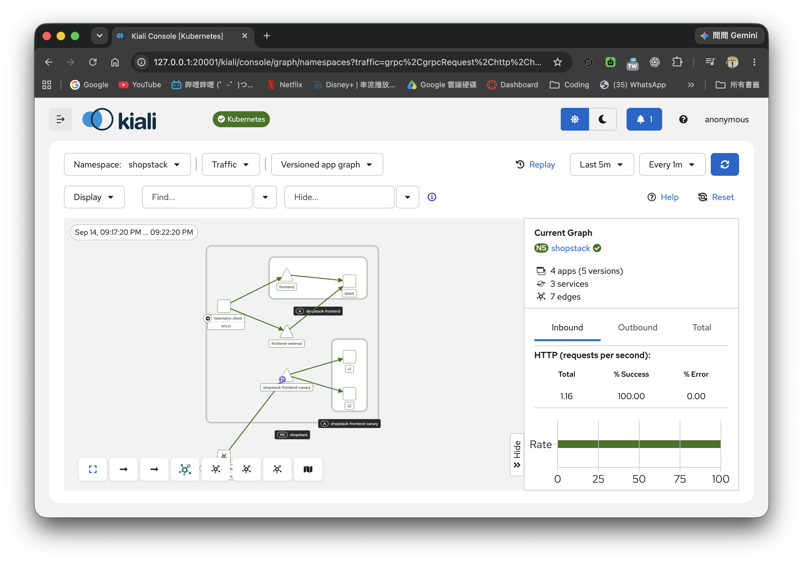
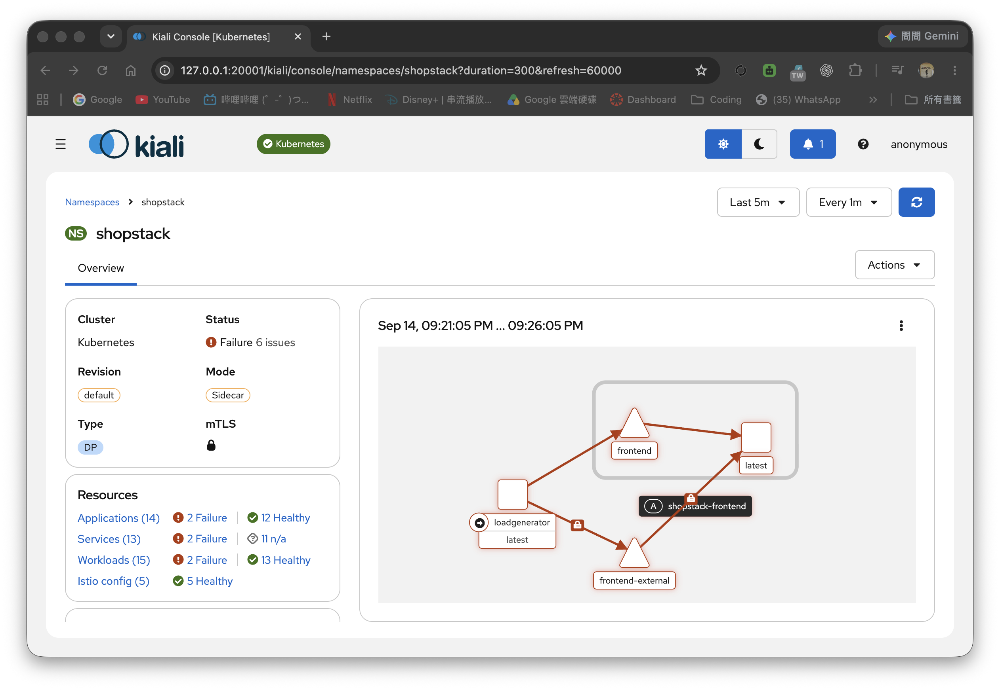
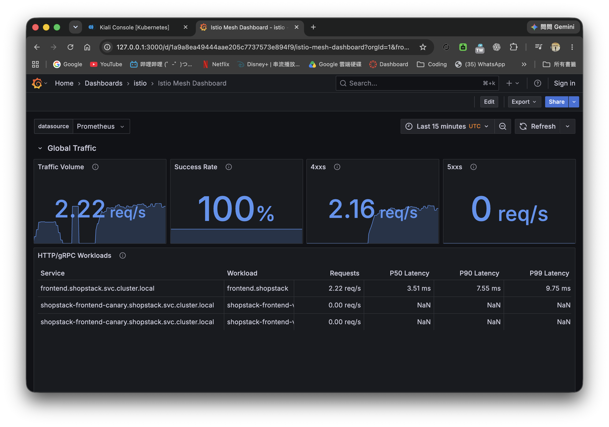
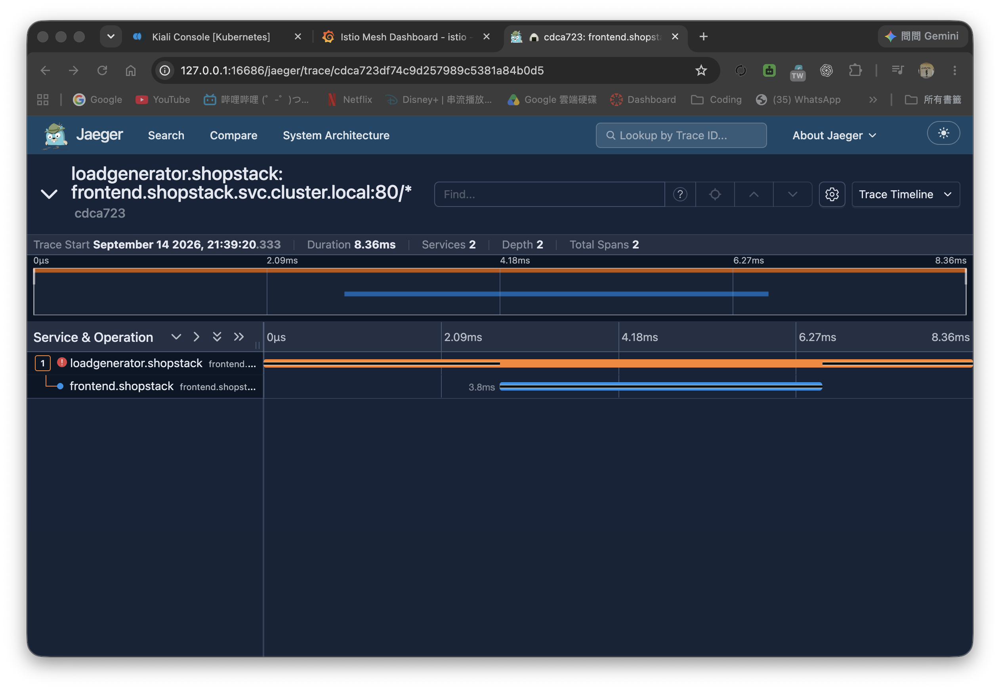

# DevOps Pre-Onboarding Practice — Journal

## Task 1 — Linux Foundations

**Date completed:** 2026-09-06  
**Host machine:** MacBook Pro  
**Lab VM:** `shopstack-lab`  
**VM platform:** Multipass 1.16.3+mac  
**Guest OS:** Ubuntu 24.04.4 LTS (Noble Numbat), aarch64  
**VM resources:** 2 vCPU, 4 GB RAM, 20 GB disk  
**Primary VM IPv4:** `192.168.252.2/24`

---

## Environment Setup

Multipass was not initially installed on the MacBook Pro.

```bash
multipass version
```

Initial result:

```text
zsh: command not found: multipass
```

I confirmed Homebrew was available:

```bash
brew --version
```

Result:

```text
Homebrew 6.0.19
```

I then installed Multipass:

```bash
brew install --cask multipass
multipass version
```

Result:

```text
multipass   1.16.3+mac
multipassd  1.16.3+mac
```

I created the lab VM and entered it:

```bash
multipass launch 24.04 \
  --name shopstack-lab \
  --cpus 2 \
  --memory 4G \
  --disk 20G

multipass shell shopstack-lab
```

I waited for first-boot initialization to finish before continuing:

```bash
cloud-init status --wait
cloud-init status
```

Result:

```text
status: done
```

I verified the host details:

```bash
hostname
uname -a
cat /etc/os-release
```

Key result:

```text
Hostname: shopstack-lab
Ubuntu 24.04.4 LTS (Noble Numbat)
Architecture: aarch64
```

---

# 4.1 Users, Groups, and Permissions

## 4.1.1 Create `deploy` and `shopstack`

I created the shared group and the deployment user with a home directory and Bash shell, then added the user to the group.

```bash
sudo groupadd shopstack
sudo useradd -m -s /bin/bash deploy
sudo usermod -aG shopstack deploy

id deploy
getent group shopstack
ls -ld /home/deploy
```

Key results:

```text
uid=1001(deploy) gid=1002(deploy) groups=1002(deploy),1001(shopstack)
shopstack:x:1001:deploy
drwxr-x--- ... deploy deploy ... /home/deploy
```

This confirmed that:

- `deploy` has its own home directory.
- Its login shell is Bash.
- `deploy` is a member of the supplementary group `shopstack`.

---

## 4.1.2 `/opt/shopstack`, Ownership, and setgid

I created the shared application directory and applied the required owner, group, and permission mode.

```bash
sudo mkdir -p /opt/shopstack
sudo chown deploy:shopstack /opt/shopstack
sudo chmod 2770 /opt/shopstack

ls -ld /opt/shopstack
```

Result:

```text
drwxrws--- ... deploy shopstack ... /opt/shopstack
```

### Meaning of `2770`

The normal permission part, `770`, means:

- owner: `rwx`
- group: `rwx`
- others: `---`

The leading `2` sets the **setgid bit** on the directory. On a directory, setgid causes newly created files and subdirectories to inherit the directory's group rather than the creator's primary group.

I verified this by creating a file as `deploy`:

```bash
sudo -u deploy touch /opt/shopstack/testfile.txt
sudo -u deploy sh -c \
  'echo "ShopStack confidential test data" > /opt/shopstack/testfile.txt'

sudo ls -l /opt/shopstack/testfile.txt
```

Result:

```text
-rw-rw-r-- 1 deploy shopstack ... /opt/shopstack/testfile.txt
```

Although `deploy` has primary group `deploy`, the file inherited group `shopstack`.

### Why setgid is useful for team directories

For a shared team directory, setgid keeps group ownership consistent automatically. Team members do not need to manually run `chgrp` after creating files, which reduces permission mistakes and makes collaboration more predictable.

---

## 4.1.3 Read-only `auditor` Access Using ACLs

I created the audit user:

```bash
sudo useradd -m -s /bin/bash auditor
id auditor
```

Result:

```text
uid=1002(auditor) gid=1003(auditor) groups=1003(auditor)
```

I installed ACL support:

```bash
sudo apt update
sudo apt install -y acl

command -v setfacl
command -v getfacl
```

Result:

```text
/usr/bin/setfacl
/usr/bin/getfacl
```

I applied read/traverse access to existing directories and read-only access to existing files, while removing permissions for `other`.

```bash
sudo find /opt/shopstack \
  -type d \
  -exec setfacl -m u:auditor:rx,o::--- {} +

sudo find /opt/shopstack \
  -type f \
  -exec setfacl -m u:auditor:r--,o::--- {} +
```

I then configured **default ACLs** so newly created files and directories would inherit appropriate auditor access.

```bash
sudo setfacl -m \
d:u::rwx,\
d:u:auditor:r-x,\
d:g::rwx,\
d:m::rwx,\
d:o::--- \
/opt/shopstack
```

Verification:

```bash
getfacl /opt/shopstack
```

Key result:

```text
user:auditor:r-x
other::---

default:user:auditor:r-x
default:other::---
```

### Existing-file test

```bash
sudo -u auditor cat /opt/shopstack/testfile.txt
```

Result:

```text
ShopStack confidential test data
```

Attempting to create or modify files failed:

```bash
sudo -u auditor touch /opt/shopstack/auditor-test.txt
```

```text
Permission denied
```

```bash
sudo -u auditor sh -c \
  'echo "HACKED" >> /opt/shopstack/testfile.txt'
```

```text
Permission denied
```

### Default ACL inheritance test

I created a new directory and file as `deploy`:

```bash
sudo -u deploy mkdir /opt/shopstack/reports

sudo -u deploy sh -c \
  'echo "September report" > /opt/shopstack/reports/september.txt'
```

I inspected the inherited ACLs:

```bash
sudo getfacl /opt/shopstack/reports
sudo getfacl /opt/shopstack/reports/september.txt
```

The new file showed:

```text
user:auditor:r-x        #effective:r--
other::---
```

The execute bit was masked on the regular file, so the effective auditor permission was read-only.

Auditor could read it:

```bash
sudo -u auditor cat /opt/shopstack/reports/september.txt
```

Result:

```text
September report
```

Auditor could not modify it:

```bash
sudo -u auditor sh -c \
  'echo "modified" >> /opt/shopstack/reports/september.txt'
```

Result:

```text
Permission denied
```

The unrelated `ubuntu` user also could not read the protected file:

```bash
cat /opt/shopstack/reports/september.txt
```

Result:

```text
Permission denied
```

This demonstrated read-only access for the named auditor without making the files world-readable.

---

## 4.1.4 Restricted Passwordless `sudo`

My lab admin user was:

```bash
whoami
```

Result:

```text
ubuntu
```

I confirmed the exact command paths:

```bash
command -v systemctl
command -v journalctl
```

Result:

```text
/usr/bin/systemctl
/usr/bin/journalctl
```

I audited the existing sudo configuration:

```bash
sudo -l
sudo -n true
echo $?

sudo grep -R "$ADMIN_USER" \
  /etc/sudoers /etc/sudoers.d/ 2>/dev/null
```

Multipass/cloud-init had created:

```text
ubuntu ALL=(ALL) NOPASSWD:ALL
```

This was broader than the task requirement.

Before restricting it, I set a normal password for the admin account as a safety measure:

```bash
sudo passwd "$ADMIN_USER"
```

I then created a dedicated sudoers rule:

```bash
printf '%s ALL=(root) NOPASSWD: /usr/bin/systemctl, /usr/bin/journalctl\n' \
"$ADMIN_USER" | \
sudo tee /etc/sudoers.d/91-shopstack-admin

sudo chmod 440 /etc/sudoers.d/91-shopstack-admin
sudo visudo -cf /etc/sudoers.d/91-shopstack-admin
```

Result:

```text
/etc/sudoers.d/91-shopstack-admin: parsed OK
```

I backed up and removed the unrestricted cloud-init rule:

```bash
sudo cp \
/etc/sudoers.d/90-cloud-init-users \
/root/90-cloud-init-users.backup

sudo sed -i \
"/^${ADMIN_USER} ALL=.*NOPASSWD: *ALL$/d" \
/etc/sudoers.d/90-cloud-init-users
```

I validated the complete sudoers configuration:

```bash
sudo visudo -c
sudo -l
```

Result:

```text
(ALL : ALL) ALL
(root) NOPASSWD: /usr/bin/systemctl, /usr/bin/journalctl
```

### Positive tests

```bash
sudo -k
sudo -n /usr/bin/systemctl --version
echo $?
```

Result:

```text
0
```

```bash
sudo -k
sudo -n /usr/bin/journalctl --version
echo $?
```

Result:

```text
0
```

### Negative test

```bash
sudo -k
sudo -n /usr/bin/id
echo $?
```

Result:

```text
sudo: a password is required
1
```

Normal authenticated sudo still worked:

```bash
sudo -k
sudo id
```

Result after password entry:

```text
uid=0(root) gid=0(root) groups=0(root)
```

### Why `NOPASSWD: ALL` is discouraged

`NOPASSWD: ALL` allows the account to run any command as root without authentication. If that account or session is compromised, the attacker immediately gains unrestricted root access. Limiting passwordless sudo reduces the attack surface and blast radius according to the principle of least privilege.

The task specifically required passwordless `systemctl` and `journalctl`. In a real production environment I would consider restricting `systemctl` further to specific services and actions because `systemctl` itself is a powerful privileged interface.

---

# 4.2 Processes, Services, and Logs

## 4.2.1 Heartbeat Script

I created the log file and assigned it to the service account/group:

```bash
sudo touch /var/log/shopstack-pulse.log
sudo chown deploy:shopstack /var/log/shopstack-pulse.log
sudo chmod 640 /var/log/shopstack-pulse.log
```

I created `/opt/shopstack/pulse.sh`:

```bash
sudo -u deploy tee /opt/shopstack/pulse.sh > /dev/null <<'EOF'
#!/usr/bin/env bash

set -euo pipefail

LOG_FILE="/var/log/shopstack-pulse.log"

while true; do
    MESSAGE="$(date --iso-8601=seconds) ShopStack heartbeat"
    echo "$MESSAGE" | tee -a "$LOG_FILE"
    sleep 10
done
EOF

sudo chmod 750 /opt/shopstack/pulse.sh
sudo ls -l /opt/shopstack/pulse.sh
```

I tested it manually:

```bash
sudo -u deploy /opt/shopstack/pulse.sh
```

Observed output:

```text
2026-09-06T17:52:32+08:00 ShopStack heartbeat
2026-09-06T17:52:42+08:00 ShopStack heartbeat
2026-09-06T17:52:52+08:00 ShopStack heartbeat
```

I stopped the manual test with `Ctrl+C` and checked the file log:

```bash
sudo tail /var/log/shopstack-pulse.log
```

The same heartbeat lines were present, confirming that the script appended a timestamped line every 10 seconds.

---

## 4.2.2 `shopstack-pulse.service`

I created the systemd unit:

```ini
[Unit]
Description=ShopStack Pulse Heartbeat Service
After=network.target

[Service]
Type=simple
User=deploy
Group=shopstack
ExecStart=/opt/shopstack/pulse.sh
Restart=always
RestartSec=2

[Install]
WantedBy=multi-user.target
```

Installed with:

```bash
cat <<'EOF' | sudo tee /etc/systemd/system/shopstack-pulse.service
[Unit]
Description=ShopStack Pulse Heartbeat Service
After=network.target

[Service]
Type=simple
User=deploy
Group=shopstack
ExecStart=/opt/shopstack/pulse.sh
Restart=always
RestartSec=2

[Install]
WantedBy=multi-user.target
EOF

sudo systemctl daemon-reload
```

### `start`

```bash
sudo systemctl start shopstack-pulse.service
sudo systemctl status shopstack-pulse.service
```

Result:

```text
Active: active (running)
Main PID: 2304
```

### `stop`

```bash
sudo systemctl stop shopstack-pulse.service
sudo systemctl status shopstack-pulse.service
```

Result:

```text
Active: inactive (dead)
```

The journal also showed:

```text
shopstack-pulse.service: Deactivated successfully.
Stopped shopstack-pulse.service
```

### `restart`

I started the service again and captured its PID:

```bash
sudo systemctl start shopstack-pulse.service

systemctl show -p MainPID --value \
shopstack-pulse.service
```

Before restart:

```text
2334
```

Then:

```bash
sudo systemctl restart shopstack-pulse.service

systemctl show -p MainPID --value \
shopstack-pulse.service
```

After restart:

```text
2357
```

The PID change confirmed that the service process was restarted.

### `status`

```bash
sudo systemctl status shopstack-pulse.service
```

Result:

```text
Active: active (running)
Main PID: 2357
```

### `enable`

```bash
sudo systemctl enable shopstack-pulse.service
systemctl is-enabled shopstack-pulse.service

ls -l \
/etc/systemd/system/multi-user.target.wants/shopstack-pulse.service
```

Result:

```text
enabled
```

Systemd created the expected symlink:

```text
.../multi-user.target.wants/shopstack-pulse.service
 -> /etc/systemd/system/shopstack-pulse.service
```

Later, after a VM reboot during the storage task, I verified:

```bash
systemctl is-active shopstack-pulse.service
```

Result:

```text
active
```

This provided additional proof that the enabled service started on boot.

---

## 4.2.3 Inspecting Logs with `journalctl`

I inspected recent service logs:

```bash
sudo journalctl \
-u shopstack-pulse.service \
-n 10 \
--no-pager
```

The journal showed heartbeat lines every 10 seconds.

I then captured a specific starting time:

```bash
SINCE="$(date '+%Y-%m-%d %H:%M:%S')"
echo "$SINCE"
```

Result:

```text
2026-09-06 17:56:31
```

After waiting:

```bash
sleep 12
```

I filtered the journal:

```bash
sudo journalctl \
-u shopstack-pulse.service \
--since "$SINCE" \
--no-pager
```

Result began after the requested timestamp:

```text
Sep 06 17:56:35 ... ShopStack heartbeat
Sep 06 17:56:45 ... ShopStack heartbeat
Sep 06 17:56:55 ... ShopStack heartbeat
```

This demonstrated time-window filtering for incident investigation.

---

## 4.2.4 Manual Process Kill and Automatic Restart

I found the service process:

```bash
pgrep -af '/opt/shopstack/pulse.sh'
```

Result:

```text
2357 bash /opt/shopstack/pulse.sh
```

I recorded and verified the old main PID:

```bash
OLD_PID=$(systemctl show \
-p MainPID \
--value shopstack-pulse.service)

echo "Old PID: $OLD_PID"
ps -fp "$OLD_PID"
```

Result:

```text
Old PID: 2357
deploy 2357 ... bash /opt/shopstack/pulse.sh
```

I force-killed the process to simulate a crash:

```bash
sudo kill -9 "$OLD_PID"
sleep 3
```

I then captured the new PID:

```bash
NEW_PID=$(systemctl show \
-p MainPID \
--value shopstack-pulse.service)

echo "New PID: $NEW_PID"
```

Result:

```text
New PID: 2499
```

Systemd status showed the service running again:

```text
Active: active (running)
Main PID: 2499
```

I verified the restart in the journal:

```bash
sudo journalctl \
-u shopstack-pulse.service \
--since "2 minutes ago" \
--no-pager
```

Key evidence:

```text
Main process exited, code=killed, status=9/KILL
Failed with result 'signal'.
Scheduled restart job, restart counter is at 1.
Started shopstack-pulse.service
```

The service then resumed heartbeat logging. This demonstrated automatic recovery through `Restart=always`.

---

# 4.3 Networking and Firewall

## 4.3.1 IP Addresses, Default Gateway, and DNS

### IP addresses

```bash
ip addr
ip -br addr
```

Key result:

```text
lo      127.0.0.1/8
enp0s1  192.168.252.2/24
```

`127.0.0.1` is the loopback interface used for communication with the local machine itself.

`192.168.252.2/24` is the VM's IPv4 address on the Multipass virtual network. `/24` corresponds to the subnet mask `255.255.255.0`.

### Default gateway

```bash
ip route
ip route show default
```

Result:

```text
default via 192.168.252.1 dev enp0s1 proto dhcp src 192.168.252.2 metric 100
```

The default gateway `192.168.252.1` is the next-hop router used when the destination is outside the directly connected local subnet.

### DNS

```bash
resolvectl status
resolvectl dns
cat /etc/resolv.conf
```

Key result:

```text
Current DNS Server: 192.168.252.1
DNS Servers: 192.168.252.1 ...
```

`/etc/resolv.conf` contained:

```text
nameserver 127.0.0.53
```

`127.0.0.53` is the local `systemd-resolved` stub resolver. Applications can query this local resolver, which then forwards requests to the upstream DNS server such as `192.168.252.1`.

---

## 4.3.2 HTTP Server on Port 8080

I created a basic test site:

```bash
mkdir -p ~/shopstack-web

echo "ShopStack HTTP test" \
> ~/shopstack-web/index.html

cd ~/shopstack-web
```

In Terminal A I started the HTTP server:

```bash
python3 -m http.server 8080
```

Result:

```text
Serving HTTP on 0.0.0.0 port 8080
```

In Terminal B I verified that the socket was listening:

```bash
ss -tlnp | grep 8080
```

Result:

```text
LISTEN ... 0.0.0.0:8080 ... python3
```

I tested loopback access:

```bash
curl http://127.0.0.1:8080
```

Result:

```text
ShopStack HTTP test
```

I then identified the VM address and tested it:

```bash
VM_IP=$(hostname -I | awk '{print $1}')
echo "$VM_IP"

curl "http://${VM_IP}:8080"
```

Result:

```text
192.168.252.2
ShopStack HTTP test
```

The Python server logs recorded successful HTTP `200` requests.

---

## 4.3.3 UFW Firewall

Initial status:

```bash
sudo ufw status verbose
```

Result:

```text
Status: inactive
```

I explicitly configured the default policies:

```bash
sudo ufw default deny incoming
sudo ufw default allow outgoing
```

I allowed only SSH and the application test port:

```bash
sudo ufw allow 22/tcp
sudo ufw allow 8080/tcp
sudo ufw show added
```

Configured rules:

```text
ufw allow 22/tcp
ufw allow 8080/tcp
```

I enabled UFW:

```bash
sudo ufw enable
sudo ufw status numbered
```

Result:

```text
Status: active

22/tcp        ALLOW IN    Anywhere
8080/tcp      ALLOW IN    Anywhere
22/tcp (v6)   ALLOW IN    Anywhere (v6)
8080/tcp (v6) ALLOW IN    Anywhere (v6)
```

### Allowed-port proof from another machine

From the MacBook Pro host I first made a command-entry mistake:

```bash
curl --max-time 5 http://VM_IP:8080
```

Result:

```text
curl: (6) Could not resolve host: VM_IP
```

`VM_IP` was a placeholder rather than a shell variable in that host terminal. I corrected the command using the actual VM address:

```bash
curl --max-time 5 http://192.168.252.2:8080
```

Result:

```text
ShopStack HTTP test
```

This proved that inbound TCP/8080 was reachable from outside the VM.

### Blocked-port proof

Inside the VM I intentionally started another HTTP server on port 9090 without adding a UFW allow rule:

```bash
python3 -m http.server 9090 \
--directory ~/shopstack-web \
>/tmp/shopstack-9090.log 2>&1 &

HTTP9090_PID=$!
echo "$HTTP9090_PID"

ss -tlnp | grep 9090
```

Result confirmed a listener:

```text
LISTEN ... 0.0.0.0:9090 ... python3
```

I verified locally that the application itself worked:

```bash
curl --max-time 5 \
http://127.0.0.1:9090
```

Result:

```text
ShopStack HTTP test
```

From the MacBook host:

```bash
curl --max-time 5 \
http://192.168.252.2:9090
```

Result:

```text
curl: (28) Connection timed out after 5006 milliseconds
```

Because port 9090 had a confirmed listening service but was unreachable from the host, this demonstrated that UFW was blocking inbound traffic that was not explicitly allowed.

I later stopped the temporary server:

```bash
kill "$HTTP9090_PID"
```

---

## 4.3.4 DNS Resolution

I confirmed the DNS lookup tools:

```bash
command -v dig
command -v nslookup
```

I resolved `kubernetes.io`:

```bash
dig kubernetes.io
```

Result:

```text
status: NOERROR
ANSWER: 2
```

Example resolved addresses:

```text
3.33.186.135
15.197.167.90
```

I resolved `istio.io`:

```bash
dig istio.io
```

Result:

```text
status: NOERROR
ANSWER: 1
75.2.60.5
```

I then intentionally queried a reserved invalid domain:

```bash
dig definitely-does-not-exist.shopstack.invalid
```

Result:

```text
status: NXDOMAIN
ANSWER: 0
```

### Meaning of the error

`NXDOMAIN` means **Non-Existent Domain**. The DNS query itself reached a working DNS resolver successfully, but the resolver replied that the requested name does not exist.

This differs from errors such as a timeout or `SERVFAIL`, which can indicate connectivity, resolver, or upstream DNS problems.

I cleaned up the temporary HTTP services and verified that ports 8080 and 9090 were no longer listening:

```bash
ss -tlnp | \
grep -E ':8080|:9090' || \
echo "Temporary HTTP servers stopped"
```

Result:

```text
Temporary HTTP servers stopped
```

---

# 4.4 Storage and Scripting Warm-up

## 4.4.1 1 GB File-backed Loop Device

I verified the required tools and current disk layout:

```bash
command -v losetup
command -v mkfs.ext4
command -v findmnt
command -v lsblk
lsblk
```

The main VM disk was `sda`, with the root filesystem on `sda1`. I did not modify its partition table.

### Create the backing file

```bash
sudo mkdir -p /var/lib/shopstack

sudo fallocate \
-l 1G \
/var/lib/shopstack/practice.img

ls -lh /var/lib/shopstack/practice.img
du -h /var/lib/shopstack/practice.img
```

Result:

```text
/var/lib/shopstack/practice.img
Apparent size: 1.0G
```

### Attach as a loop device

```bash
LOOP_DEV=$(sudo losetup \
--find \
--show \
/var/lib/shopstack/practice.img)

echo "$LOOP_DEV"

sudo losetup -l
lsblk
```

Result:

```text
/dev/loop0
```

The loop device mapped to:

```text
/var/lib/shopstack/practice.img
```

### Format as ext4

```bash
sudo mkfs.ext4 "$LOOP_DEV"

lsblk -f "$LOOP_DEV"
sudo blkid "$LOOP_DEV"
```

Result:

```text
TYPE="ext4"
UUID="3d70f29a-c92f-4168-a363-88e965b0f8bb"
```

### Mount at `/mnt/practice`

```bash
sudo mkdir -p /mnt/practice
sudo mount "$LOOP_DEV" /mnt/practice

findmnt /mnt/practice
df -h /mnt/practice
```

Result:

```text
/mnt/practice /dev/loop0 ext4 rw,relatime
/dev/loop0 974M ... /mnt/practice
```

### Persistent `/etc/fstab` configuration

I backed up `/etc/fstab` first:

```bash
sudo cp /etc/fstab /etc/fstab.backup
```

Then added:

```bash
echo '/var/lib/shopstack/practice.img /mnt/practice ext4 loop,defaults 0 2' \
| sudo tee -a /etc/fstab

tail -n 5 /etc/fstab
sudo systemctl daemon-reload
```

The final entry was:

```text
/var/lib/shopstack/practice.img /mnt/practice ext4 loop,defaults 0 2
```

Using the backing-file path with the `loop` mount option allows `mount` to create the loop mapping automatically instead of relying on a fixed `/dev/loopN` number.

### Test `fstab` before reboot

I unmounted the filesystem and removed the manually attached loop device:

```bash
sudo umount /mnt/practice
findmnt /mnt/practice

sudo losetup -d "$LOOP_DEV"
sudo losetup -l
```

I then mounted using only the `/etc/fstab` entry:

```bash
sudo mount /mnt/practice

findmnt /mnt/practice
df -h /mnt/practice
sudo losetup -l
```

Result:

```text
/mnt/practice /dev/loop0 ext4 rw,relatime
```

`losetup` showed the loop device pointing to the backing file with `AUTOCLEAR=1`.

### Reboot persistence test

I rebooted the VM:

```bash
sudo reboot
```

After reconnecting, without manually mounting anything:

```bash
findmnt /mnt/practice
df -h /mnt/practice
sudo losetup -l
```

Result:

```text
/mnt/practice /dev/loop0 ext4 rw,relatime
/dev/loop0 -> /var/lib/shopstack/practice.img
```

This proved that the filesystem survived reboot through `/etc/fstab`.

I also checked:

```bash
systemctl is-active \
shopstack-pulse.service
```

Result:

```text
active
```

This provided additional evidence that the systemd service configured earlier also started automatically after reboot.

---

## 4.4.2 Disk Usage Investigation and Cleanup

I created a controlled test directory:

```bash
sudo mkdir -p \
/mnt/practice/fill-test

sudo chown \
"$USER":"$USER" \
/mnt/practice/fill-test
```

I created an 850 MB test file:

```bash
fallocate \
-l 850M \
/mnt/practice/fill-test/bigfile.bin
```

I checked filesystem usage with `df`:

```bash
df -h /mnt/practice
```

Result:

```text
/dev/loop0 974M 851M 57M 94% /mnt/practice
```

This pushed the filesystem above the required 90% threshold.

### Find the largest consumers with `du`

```bash
du -ah /mnt/practice/fill-test \
| sort -rh \
| head -10
```

Result:

```text
851M /mnt/practice/fill-test/bigfile.bin
851M /mnt/practice/fill-test
```

### `ncdu`

```bash
command -v ncdu
```

There was no output, so `ncdu` was not installed. The task specified `ncdu` only **if available**, so I recorded this and continued without installing it.

### Cleanup

```bash
rm \
/mnt/practice/fill-test/bigfile.bin

df -h /mnt/practice

du -ah /mnt/practice/fill-test \
| sort -rh \
| head -10
```

Result:

```text
/dev/loop0 ... 1% /mnt/practice
4.0K /mnt/practice/fill-test
```

The filesystem returned from 94% usage to 1%.

---

## 4.4.3 `diskguard.sh`, ShellCheck, and Cron

I created `~/diskguard.sh` to inspect all mounted filesystems and return a failure if any one exceeds 80% usage.

```bash
cat > ~/diskguard.sh <<'EOF'
#!/usr/bin/env bash

set -euo pipefail

THRESHOLD=80
EXIT_CODE=0

while read -r filesystem capacity mountpoint; do
    usage=${capacity%\%}

    if (( usage > THRESHOLD )); then
        echo "WARNING: ${mountpoint} (${filesystem}) usage is ${usage}%, above ${THRESHOLD}%."
        EXIT_CODE=1
    fi
done < <(df --output=source,pcent,target | tail -n +2)

if (( EXIT_CODE == 0 )); then
    echo "OK: no mounted filesystem exceeds ${THRESHOLD}% usage."
fi

exit "$EXIT_CODE"
EOF

chmod +x ~/diskguard.sh
```

### Install and run ShellCheck

```bash
sudo apt update
sudo apt install -y shellcheck

command -v shellcheck
shellcheck ~/diskguard.sh
echo $?
```

Result:

```text
/usr/bin/shellcheck
0
```

ShellCheck produced no warnings and returned exit code 0.

### Healthy-state test

```bash
~/diskguard.sh
echo $?
```

Result:

```text
OK: no mounted filesystem exceeds 80% usage.
0
```

### High-usage test

I recreated the 850 MB file:

```bash
fallocate \
-l 850M \
/mnt/practice/fill-test/bigfile.bin

df -h /mnt/practice
```

Result:

```text
94% /mnt/practice
```

I then ran:

```bash
~/diskguard.sh
echo $?
```

Result:

```text
WARNING: /mnt/practice (/dev/loop0) usage is 94%, above 80%.
1
```

This confirmed the required warning and exit code `1`.

I cleaned up and retested:

```bash
rm \
/mnt/practice/fill-test/bigfile.bin

df -h /mnt/practice

~/diskguard.sh
echo $?
```

Result:

```text
1% /mnt/practice
OK: no mounted filesystem exceeds 80% usage.
0
```

### Cron job

I prepared the log file:

```bash
sudo touch /var/log/diskguard.log

sudo chown \
"$USER":"$USER" \
/var/log/diskguard.log

sudo chmod 640 \
/var/log/diskguard.log

ls -l /var/log/diskguard.log
```

I installed a cron entry that runs every 15 minutes:

```bash
(
  crontab -l 2>/dev/null
  echo '*/15 * * * * /home/ubuntu/diskguard.sh >> /var/log/diskguard.log 2>&1'
) | crontab -
```

Verification:

```bash
crontab -l
```

Result:

```text
*/15 * * * * /home/ubuntu/diskguard.sh >> /var/log/diskguard.log 2>&1
```

I confirmed the cron daemon was active:

```bash
systemctl status cron --no-pager
```

Result:

```text
Active: active (running)
```

I also tested the exact command used by cron to confirm that output redirection to the required log worked:

```bash
/home/ubuntu/diskguard.sh \
>> /var/log/diskguard.log 2>&1

cat /var/log/diskguard.log
```

Result:

```text
OK: no mounted filesystem exceeds 80% usage.
```

---

# Checkpoint Questions

## 1. What is the difference between a hard link and a symbolic link?

A **hard link** is another directory entry pointing to the same inode as the original file. Both names refer directly to the same underlying file data. Deleting one filename does not remove the data while another hard link still exists. Hard links normally cannot cross filesystem boundaries, and creating hard links to directories is generally restricted.

A **symbolic link (symlink)** is a separate filesystem object that stores a path to another file or directory. It has its own inode. It can cross filesystem boundaries and can point to directories, but if the target is deleted or moved the symlink becomes broken.

In short:

- hard link → another name for the same inode/data
- symbolic link → a separate file containing a path to another object

---

## 2. What do the `load average` numbers in `uptime` mean?

`uptime` normally shows three load-average values representing approximately the last:

1. 1 minute
2. 5 minutes
3. 15 minutes

Linux load average reflects the average number of tasks that are runnable or waiting in uninterruptible sleep, commonly including processes waiting for CPU or certain I/O.

The values must be interpreted relative to the number of CPU cores. For example, on a 2-CPU VM:

- load around `1.0` means roughly half of total CPU scheduling capacity is demanded
- load around `2.0` means the CPUs are approximately fully occupied
- load persistently above `2.0` suggests work is waiting for CPU or other resources

A high load average is therefore a signal to investigate, not automatically proof of high CPU usage alone.

---

## 3. What happens to file permissions when using `scp` versus `rsync -a`?

`scp` primarily copies file contents to the destination. The newly created destination file is generally subject to destination-side creation rules such as the user's `umask`; metadata preservation is not the main default behaviour.

`rsync -a` uses archive mode. Archive mode is designed to preserve important metadata, including permissions, timestamps, symbolic links, and other attributes where permissions and platform capabilities allow it.

Therefore:

- `scp` → convenient transfer, but destination permissions may be recreated according to the destination environment
- `rsync -a` → designed to preserve source metadata and is generally more appropriate when permissions and file attributes must be retained

---

# Task 1 Summary

All Task 1 practical requirements were completed successfully:

- Created and managed Linux users, groups, setgid permissions, and ACLs.
- Implemented restricted passwordless sudo using the principle of least privilege.
- Built and managed a systemd service with automatic restart.
- Used `journalctl` for service and time-filtered log inspection.
- Identified IP, routing, and DNS configuration.
- Tested HTTP listening and connectivity.
- Configured UFW with default-deny inbound policy and verified both allowed and blocked ports from the MacBook host.
- Performed successful and failing DNS lookups.
- Built a persistent 1 GB loop-backed ext4 filesystem and verified it after reboot.
- Investigated a filesystem above 90% usage using `df` and `du`, then cleaned it up.
- Created a ShellCheck-clean disk monitoring script with correct exit codes.
- Added the disk monitor to cron on a 15-minute schedule with log output.

## Troubleshooting Notes

### Multipass was missing

**Symptom**

```text
zsh: command not found: multipass
```

**Resolution**

Verified Homebrew, installed Multipass with:

```bash
brew install --cask multipass
```

Then successfully created the Ubuntu lab VM.

### Incorrect host-side placeholder in `curl`

**Symptom**

```bash
curl --max-time 5 http://VM_IP:8080
```

returned:

```text
curl: (6) Could not resolve host: VM_IP
```

**Cause**

`VM_IP` was typed as a literal placeholder in the MacBook shell rather than replaced by the actual VM address.

**Resolution**

Used the real Multipass IPv4 address:

```bash
curl --max-time 5 http://192.168.252.2:8080
```

Result:

```text
ShopStack HTTP test
```

This reinforced the difference between a documentation placeholder, a shell variable such as `$VM_IP`, and a literal hostname.

---

**Task 1 status: COMPLETE**

---

# Task 2 — Proxmox and VM Provisioning

## 5.1 Hypervisor Orientation

No Proxmox VE hardware was available. The documented Task 2 fallback permits three cloud VMs or three local VirtualBox VMs.

The MacBook Pro was initially evaluated for the local VirtualBox fallback. It had approximately 8 GB RAM and approximately 25 GiB free storage. Because the Kubernetes environment requires three VMs with 4 GB RAM each, running the full environment locally would heavily overcommit the MacBook and risk resource pressure.

Google Compute Engine was therefore selected for the Final Run.

Provider-specific VPC, subnet, firewall, and initial source-VM settings were configured in the GCP Console. The reusable Machine Image, VM clones, snapshots, resource verification, and static-IP reservation were then performed with `gcloud` in Google Cloud Shell.

VirtualBox 7.2.16 ARMv8 was inspected on the MacBook Pro.

Closest fallback inspection mappings included:

- `qm list` -> `VBoxManage list vms`
- `pct list` -> no direct VirtualBox equivalent
- `pvesm status` -> `VBoxManage list hdds`
- `ip link` -> macOS `ifconfig`

### LXC vs QEMU/KVM

LXC containers share the host Linux kernel. They are lightweight, start quickly, and have low overhead, but provide less kernel isolation and cannot run their own independent guest kernel.

QEMU/KVM virtual machines run their own guest kernels and virtual hardware. They use more resources but provide stronger isolation.

Independent VMs are appropriate for this Kubernetes lab because each Kubernetes node should behave as an independent Linux system.

## 5.2 Cloud-Init VM Template

Under the cloud fallback:

- the official Ubuntu 24.04 LTS GCE image replaced manual `qm disk import`;
- GCE metadata `user-data` replaced the Proxmox cloud-init drive;
- a GCE Machine Image replaced the Proxmox VM template;
- independent Persistent Disks provided the equivalent of full clones.

A dedicated SSH key was created:

`~/.ssh/shopstack_lab_ed25519`

The source VM `shopstack-template-source` used Ubuntu 24.04 LTS, x86_64, `e2-medium`, 2 vCPU, 4 GB RAM, and a 40 GB `pd-standard` disk.

Cloud-init created/configured the `ubuntu` user, installed the SSH authorized key, disabled password SSH authentication, disabled direct root SSH login, and expanded the root filesystem.

Verification showed:

- `cloud-init status`: `done`
- user: `ubuntu`
- internal IP: `10.10.0.2`
- disk: 40 GB
- root partition: approximately 39 GB
- root filesystem: approximately 38 GB ext4

Passwordless SSH succeeded from the MacBook Pro.

Before imaging, the source VM was cleaned using:

`sudo cloud-init clean --logs --machine-id`

The source VM was powered off.

A reusable Machine Image was created:

`shopstack-ubuntu2404-template`

Status: `READY`

Three VMs were created from the reusable image:

- `k8s-cp` — 10.10.0.10
- `k8s-worker-1` — 10.10.0.11
- `k8s-worker-2` — 10.10.0.12

All three use `e2-medium`, with 2 vCPU and 4 GB RAM.

Each node has its own independent 40 GB `pd-standard` disk.

A full clone has an independent disk and can operate independently of the original source template.

A linked clone stores changes relative to a shared parent/base image. It requires less storage, but it depends on that base image.

All three Kubernetes VMs were verified through passwordless SSH.

For each node:

- `cloud-init status` returned `done`;
- the `ubuntu` user was present;
- `hostnamectl` was checked;
- `ip -4 -br a` showed the expected internal IP;
- `lsblk` showed a 40 GB disk;
- `df -hT /` showed approximately 38 GB ext4 root filesystem.

Snapshots were created:

- `k8s-cp-pre-task3`
- `k8s-worker-1-pre-task3`
- `k8s-worker-2-pre-task3`

All three snapshots reported `READY`.

Snapshots are not substitutes for a complete backup strategy. A traditional hypervisor snapshot is primarily a rollback mechanism and may still depend on the same underlying storage.

A real backup design requires independent storage, scheduling, retention, verification, and restore testing.

In Proxmox VE, a backup job would define the protected VM, target storage, schedule, backup mode, and retention.

For example, a Proxmox backup job for `k8s-cp` could run nightly at 02:00 in snapshot mode, write to a Proxmox Backup Server datastore, retain the last 7 daily backups and 4 weekly backups, and include periodic test restores.

In a production environment, Proxmox Backup Server would provide a dedicated backup target with incremental backups, deduplication, verification, retention management, and restore capabilities.

## 5.3 Resource and Networking Hygiene

The GCE `e2-medium` machine type was verified as:

- 2 guest vCPUs
- 4096 MB RAM

The Kubernetes control-plane VM was verified as using `e2-medium`.

Proxmox-style memory ballooning is not exposed as a configurable Google Compute Engine control.

In Proxmox/QEMU, memory ballooning uses a guest balloon driver that allows the hypervisor to dynamically reclaim unused memory from a VM and later return memory when required.

Under the GCP fallback, CPU and RAM were configured through the GCE machine type. Ballooning was documented rather than falsely claiming that a Proxmox-specific control had been configured.

The cluster IP plan is:

- `k8s-cp` — 10.10.0.10
- `k8s-worker-1` — 10.10.0.11
- `k8s-worker-2` — 10.10.0.12

The three addresses were promoted to reserved static internal IPv4 addresses and verified as `IN_USE`.

The MacBook Pro `~/.ssh/config` contains entries for all three nodes.

The following aliases were verified using SSH key authentication:

- `ssh k8s-cp`
- `ssh k8s-worker-1`
- `ssh k8s-worker-2`

Each alias returned the correct hostname, the `ubuntu` user, and the expected internal IP.

## Checkpoint Questions

### What does cloud-init do on first boot, and which of its modules did you use?

Cloud-init automates first-boot initialization using metadata and user-data provided by the platform.

In this lab, cloud-init configured the `ubuntu` user, sudo access, SSH authorized key, password SSH policy, root-login policy, root-partition growth, and root-filesystem resize.

The cloud-config used the `users` section and SSH authentication settings (`ssh_authorized_keys`, `ssh_pwauth`, and `disable_root`), together with `growpart` and `resize_rootfs`. GCE supplied instance metadata and network configuration through its cloud datasource.

### Why build a template instead of installing Ubuntu three times from ISO?

A template provides a consistent and reproducible baseline.

It is faster than performing three independent ISO installations, reduces manual configuration and human error, limits configuration drift, and makes it easy to provision additional nodes in the same known state.

### What is the difference between thick and thin provisioning, and which does `local-lvm` use?

Thick provisioning allocates or reserves virtual-disk storage capacity up front.

Thin provisioning allocates physical storage progressively as data is written, allowing the underlying storage pool to be used more efficiently.

Proxmox `local-lvm` uses LVM-thin and therefore uses thin provisioning.

---

# Task 2 Summary

All Task 2 practical requirements were completed successfully using the documented cloud-VM fallback:

- Evaluated the MacBook Pro as a possible local VirtualBox host.
- Installed and inspected VirtualBox 7.2.16 ARMv8.
- Selected Google Compute Engine after determining that the MacBook Pro did not have sufficient local resources for three 4 GB Kubernetes VMs.
- Created a dedicated ShopStack SSH key.
- Built an Ubuntu 24.04 LTS cloud-init source VM.
- Verified the `ubuntu` user, SSH key authentication, DHCP networking, hostname, 40 GB boot disk, and expanded root filesystem.
- Cleaned the source VM with `cloud-init clean` and created the reusable `shopstack-ubuntu2404-template` Machine Image.
- Provisioned `k8s-cp`, `k8s-worker-1`, and `k8s-worker-2` from the reusable image.
- Verified all three nodes with passwordless SSH, `cloud-init`, `hostnamectl`, network, and disk checks.
- Created and verified a snapshot for each Kubernetes node.
- Verified the `e2-medium` resource allocation of 2 vCPU and 4 GB RAM.
- Reserved stable internal addresses `10.10.0.10`, `10.10.0.11`, and `10.10.0.12`.
- Configured `~/.ssh/config` aliases and successfully connected using `ssh k8s-cp`, `ssh k8s-worker-1`, and `ssh k8s-worker-2`.
- Documented the IP plan, cloud-init template design, snapshot/backup strategy, and Proxmox fallback mappings in the repository.

## Troubleshooting Notes

### VirtualBox CLI was not initially available

**Symptom**

The first VirtualBox version check failed:

```bash
VBoxManage --version
```

Result:

```text
zsh: command not found: VBoxManage
```

**Cause**

VirtualBox was not installed on the MacBook Pro.

**Resolution**

Installed VirtualBox with Homebrew:

```bash
brew install --cask virtualbox
```

Then verified the installation:

```bash
VBoxManage --version
```

Result:

```text
7.2.16r174877
```

I also inspected the platform capabilities with:

```bash
VBoxManage list systemproperties
```

The installed VirtualBox build supported the ARMv8 platform used by the Apple M2 host.

### Local VirtualBox resources were insufficient for the final three-node environment

**Symptom**

I inspected the MacBook Pro hardware:

```bash
system_profiler SPHardwareDataType \
  | grep -E 'Model Name|Model Identifier|Chip|Total Number of Cores|Memory'
```

Key result:

```text
Model Name: MacBook Pro
Chip: Apple M2
Total Number of Cores: 8
Memory: 8 GB
```

I also checked available storage:

```bash
df -h "$HOME"
```

Key result:

```text
Available storage: approximately 25 GiB
```

The required final Kubernetes environment consisted of:

```text
k8s-cp        4 GB RAM
k8s-worker-1  4 GB RAM
k8s-worker-2  4 GB RAM
```

The guest RAM requirement alone was therefore 12 GB, which already exceeded the MacBook Pro's 8 GB of physical memory before accounting for macOS and VirtualBox overhead.

The limited remaining local disk space also provided little headroom for three VM boot disks and later Kubernetes workloads.

**Cause**

Although VirtualBox itself worked on the Apple M2 host, the MacBook Pro did not have sufficient RAM and storage headroom to run the required three-node final environment reliably.

**Resolution**

The task documentation explicitly allows a cloud-VM fallback when Proxmox hardware is unavailable.

I therefore selected Google Compute Engine for the Final Run.

The final GCP design used:

```text
k8s-cp        e2-medium   2 vCPU / 4 GB   40 GB pd-standard
k8s-worker-1  e2-medium   2 vCPU / 4 GB   40 GB pd-standard
k8s-worker-2  e2-medium   2 vCPU / 4 GB   40 GB pd-standard
```

This preserved the learning goals of reproducible VM provisioning, cloud-init, template-based deployment, stable networking, and later Ansible automation without overcommitting the MacBook Pro.

### Ephemeral external IP was reused by a different VM

**Symptom**

The source VM originally used the external IPv4 address:

```text
34.42.37.172
```

After the source VM was powered off and the Kubernetes nodes were created, GCP assigned the same external address to the new `k8s-cp` VM.

The MacBook Pro still had the previous SSH host key for that IP in `~/.ssh/known_hosts`.

**Cause**

The external address was ephemeral and could be reused by Google Cloud after the original VM stopped using it.

Because the new VM had a different SSH host key, keeping the previous entry could cause an SSH host-key mismatch.

**Resolution**

Removed only the old entry for that IP before connecting to the new VM:

```bash
ssh-keygen -R 34.42.37.172
```

This allowed the new `k8s-cp` host key to be accepted cleanly.

### Control-plane hostname initially used the GCE internal FQDN

**Symptom**

Initial verification of `k8s-cp` returned:

```text
k8s-cp.us-central1-a.c.project-d289b572-dfb9-4c0f-9db.internal
```

`hostnamectl` also showed:

```text
Static hostname: (unset)
```

**Cause**

The control-plane VM was using a transient hostname supplied by Google Compute Engine instead of an explicitly configured static hostname.

**Resolution**

Set explicit static hostnames:

```bash
sudo hostnamectl set-hostname k8s-cp
```

```bash
sudo hostnamectl set-hostname k8s-worker-1
```

```bash
sudo hostnamectl set-hostname k8s-worker-2
```

Verification returned the expected short hostnames:

```text
k8s-cp
k8s-worker-1
k8s-worker-2
```

This made the node identities consistent for later Ansible and Kubernetes configuration.

### SSH firewall source could not be pinned to one VPN public IP

**Symptom**

The administrator's VPN exit IP changes frequently.

A firewall rule restricted to a single `/32` public IP would therefore stop allowing SSH whenever the VPN endpoint changed.

**Cause**

The VPN uses changing public exit addresses rather than one stable administrator source address.

**Resolution**

For this temporary lab, the SSH firewall rule was configured as:

```text
Protocol/port: TCP/22
Source: 0.0.0.0/0
Target tag: shopstack-k8s
```

SSH still requires the dedicated ShopStack private key and the rule only applies to VMs carrying the `shopstack-k8s` network tag.

This is a lab convenience and not a production recommendation.

In production, SSH access should instead be restricted to trusted source ranges or provided through a controlled mechanism such as Identity-Aware Proxy, a VPN with stable addressing, or a bastion host.

### macOS `.DS_Store` appeared as an untracked repository file

**Symptom**

Before staging the Task 2 deliverables:

```bash
git status --short
```

showed:

```text
?? .DS_Store
```

**Cause**

Finder automatically created a macOS `.DS_Store` metadata file in the repository directory.

It was not part of the Task 2 deliverables.

**Resolution**

Removed it before staging:

```bash
rm -f .DS_Store
```

A subsequent `git status --short` showed only the intended Task 2 deliverables.

---

**Task 2 status: COMPLETE**
---

# Task 3 — Ansible: Automated K8s Node Setup

**Date completed:** 2026-09-13
**Control node:** MacBook Pro
**Managed platform:** Google Compute Engine
**Managed OS:** Ubuntu 24.04.4 LTS, x86_64
**Kubernetes version:** v1.37.0
**Container runtime:** containerd 2.2.1

The three Task 2 VMs were reused directly:

```text
k8s-cp        10.10.0.10
k8s-worker-1  10.10.0.11
k8s-worker-2  10.10.0.12
```

All node preparation and Kubernetes bootstrap configuration in this task was performed through Ansible. No interactive SSH session was used to configure the managed nodes.

---

# 6.1 Ansible Foundations

## 6.1.1 Install Ansible and Create the Inventory

At the start of Task 3, the repository was clean and the latest commit was the completed Task 2 commit:

```bash
cd ~/shopstack-devops-lab
pwd
git status
git log --oneline --decorate -3
```

Key result:

```text
/Users/peipei/shopstack-devops-lab
On branch main
nothing to commit, working tree clean

f92f3a6 (HEAD -> main) Complete Task 2 VM provisioning
0fc7b09 Complete Task 1 Linux foundations
```

Ansible was not initially installed:

```bash
ansible --version
```

Result:

```text
zsh: command not found: ansible
```

I installed Ansible with Homebrew:

```bash
brew install ansible
```

Verification:

```bash
ansible --version
```

Key result:

```text
ansible [core 2.21.4]
Ansible package: 14.4.0
Python: 3.14.7
Executable: /opt/homebrew/bin/ansible
```

I created the Ansible directory and inventory:

```bash
mkdir -p ansible
```

`ansible/inventory.ini`:

```ini
[control_plane]
k8s-cp node_ip=10.10.0.10

[workers]
k8s-worker-1 node_ip=10.10.0.11
k8s-worker-2 node_ip=10.10.0.12

[all:vars]
ansible_user=ubuntu
ansible_python_interpreter=/usr/bin/python3
```

The inventory separates the control-plane and worker groups while preserving the stable internal GCP addresses for Kubernetes node configuration.

## 6.1.2 Verify Ansible Connectivity

From the `ansible/` directory, I tested all three nodes:

```bash
ansible all -i inventory.ini -m ping
```

Result:

```text
k8s-cp       SUCCESS -> pong
k8s-worker-1 SUCCESS -> pong
k8s-worker-2 SUCCESS -> pong
```

### Why Ansible is agentless

Ansible uses an **agentless, push-based** model. The control node connects to managed Linux nodes over SSH and executes modules using Python available on the managed nodes. A continuously running Ansible-specific agent is not required.

In this lab:

```text
MacBook Pro
    |
    | SSH + Python
    v
k8s-cp
k8s-worker-1
k8s-worker-2
```

A pull-based configuration model works in the opposite direction: the managed node periodically contacts a central service or repository, downloads its desired configuration, and applies it locally.

In short:

```text
Push model: control system -> managed node
Pull model: managed node -> configuration source
```

## 6.1.3 Gather Facts and Check Uptime

I gathered operating-system facts from all nodes:

```bash
ansible all -i inventory.ini -m setup | grep ansible_distribution
```

All three nodes reported Ubuntu 24.04 Noble information:

```text
ansible_distribution: Ubuntu
ansible_distribution_major_version: 24
ansible_distribution_release: noble
ansible_distribution_version: 24.04
```

I checked uptime on all three nodes with one command:

```bash
ansible all -i inventory.ini -m command -a uptime
```

Key result:

```text
k8s-worker-1: up 3:17
k8s-worker-2: up 3:17
k8s-cp:       up 3:18
```

The Ansible `command` module displayed `CHANGED` because it executed a command, but `uptime` itself did not modify the systems.

I also confirmed the Ansible collections used by the playbook:

```bash
ansible-galaxy collection list | grep -E 'community\.general|ansible\.posix'
```

Result:

```text
ansible.posix       2.2.2
community.general   13.4.0
```

---

# 6.2 Node Preparation Playbook

I created `ansible/k8s-node-setup.yaml` using three roles:

```text
common
containerd
k8s_packages
```

The final playbook structure was:

```yaml
---
- name: Prepare Kubernetes nodes
  hosts: all
  become: true
  gather_facts: true

  roles:
    - common
    - containerd
    - k8s_packages
```

I used syntax checks while building the playbook:

```bash
ansible-playbook -i inventory.ini k8s-node-setup.yaml --syntax-check
```

Result:

```text
playbook: k8s-node-setup.yaml
```

## 6.2.1 `common` Role

I created:

```text
ansible/roles/common/tasks/main.yml
```

The role performs the following actions on all three nodes:

- sets each hostname from the Ansible inventory;
- adds all three Kubernetes nodes to `/etc/hosts`;
- disables active swap;
- comments swap entries out of `/etc/fstab`;
- persists the `overlay` and `br_netfilter` kernel modules;
- loads both modules immediately;
- configures the required Kubernetes sysctls.

The managed `/etc/hosts` block is:

```text
10.10.0.10 k8s-cp
10.10.0.11 k8s-worker-1
10.10.0.12 k8s-worker-2
```

Kernel modules are persisted in `/etc/modules-load.d/k8s.conf`:

```text
overlay
br_netfilter
```

The Kubernetes sysctls are stored in `/etc/sysctl.d/99-kubernetes.conf`:

```text
net.bridge.bridge-nf-call-iptables=1
net.ipv4.ip_forward=1
```

The first `common` role run completed successfully:

```text
k8s-cp        changed=4 failed=0
k8s-worker-1  changed=4 failed=0
k8s-worker-2  changed=4 failed=0
```

I verified the final state on all three nodes through Ansible. The hostnames were correct, `/etc/hosts` contained all three node mappings, `swapon --show` returned no active swap devices, and no uncommented swap entry remained in `/etc/fstab`.

The required modules were loaded:

```text
br_netfilter
overlay
```

The live sysctl values were:

```text
net.bridge.bridge-nf-call-iptables = 1
net.ipv4.ip_forward = 1
```

This confirmed that the `common` role prepared all three nodes for Kubernetes networking and scheduling requirements.

## 6.2.2 `containerd` Role

I created:

```text
ansible/roles/containerd/tasks/main.yml
ansible/roles/containerd/handlers/main.yml
```

The role:

- installs `containerd`;
- creates `/etc/containerd`;
- generates the default containerd configuration;
- changes the cgroup driver to systemd;
- enables and starts the service;
- restarts containerd through a handler when the configuration changes.

The configuration was generated from:

```text
containerd config default
```

and the required cgroup setting was changed to:

```text
SystemdCgroup = true
```

The first containerd run completed successfully:

```text
k8s-cp        changed=5 failed=0
k8s-worker-1  changed=5 failed=0
k8s-worker-2  changed=5 failed=0
```

Verification on all three nodes showed:

```text
containerd 2.2.1
SystemdCgroup = true
service: active
service: enabled
```

## 6.2.3 `k8s_packages` Role

I created:

```text
ansible/roles/k8s_packages/tasks/main.yml
ansible/roles/k8s_packages/defaults/main.yml
```

The pinned values were:

```yaml
kubernetes_repo_minor: "v1.37"
kubernetes_package_version: "1.37.0-1.1"
```

The role:

- installs repository prerequisites;
- downloads the Kubernetes repository signing key;
- creates the GPG keyring;
- configures the Kubernetes v1.37 apt repository;
- installs exact versions of `kubelet`, `kubeadm`, and `kubectl`;
- holds all three packages using Ansible `dpkg_selections`.

The configured repository was:

```text
https://pkgs.k8s.io/core:/stable:/v1.37/deb/
```

The first package installation run completed successfully:

```text
k8s-cp        changed=6 failed=0
k8s-worker-1  changed=6 failed=0
k8s-worker-2  changed=6 failed=0
```

Runtime checks returned:

```text
kubeadm: v1.37.0
kubelet: Kubernetes v1.37.0
kubectl: Client Version v1.37.0
```

An initial attempt to display the exact Debian package versions with:

```bash
dpkg-query -W -f="${Package} ${Version}\n" kubelet kubeadm kubectl
```

inside an Ansible shell command produced blank version lines because the remote shell expanded `${Package}` and `${Version}` before `dpkg-query` interpreted them as format placeholders.

I corrected the verification with:

```bash
ansible all -i inventory.ini -b -m command -a "dpkg-query -W kubelet kubeadm kubectl"
```

All three nodes returned:

```text
kubeadm  1.37.0-1.1
kubectl  1.37.0-1.1
kubelet  1.37.0-1.1
```

The held packages were also verified:

```text
kubeadm
kubectl
kubelet
```

---

# 6.3 Bootstrap the Kubernetes Cluster with kubeadm

## Preflight Verification

Before initializing Kubernetes, I inspected the actual GCP networking and runtime state through Ansible.

Observed node addressing:

```text
k8s-cp        ens4  10.10.0.10/32
k8s-worker-1  ens4  10.10.0.11/32
k8s-worker-2  ens4  10.10.0.12/32
```

The default gateway was `10.10.0.1`.

All nodes reported:

```text
NTPSynchronized=yes
```

Before bootstrap:

```text
admin.conf=absent
kubelet.conf=absent
```

The containerd CRI plugins reported:

```text
io.containerd.cri.v1 images   ok
io.containerd.cri.v1 runtime  linux/amd64 ok
```

This confirmed that the nodes were synchronized, had clean kubeadm state, and had a working containerd CRI implementation.

## 6.3.1 Create `k8s-cluster.yaml` and Bootstrap the Cluster

I created:

```text
ansible/k8s-cluster.yaml
```

The kubeadm configuration used:

```text
Kubernetes version: v1.37.0
API advertise address: 10.10.0.10
Pod network CIDR: 10.244.0.0/16
Service CIDR: 10.96.0.0/12
CRI socket: unix:///run/containerd/containerd.sock
```

The control-plane node registration explicitly used `10.10.0.10` as the node IP.

Initialization was guarded by the existence of:

```text
/etc/kubernetes/admin.conf
```

so rerunning the playbook would not initialize the cluster again.

I checked the playbook syntax:

```bash
ansible-playbook -i inventory.ini k8s-cluster.yaml --syntax-check
```

Result:

```text
playbook: k8s-cluster.yaml
```

I then initialized the control plane:

```bash
ansible-playbook -i inventory.ini k8s-cluster.yaml
```

Initial recap:

```text
k8s-cp: changed=4 failed=0
```

After initialization:

```text
admin.conf=PRESENT
```

The Kubernetes API server was:

```text
https://10.10.0.10:6443
```

Before a CNI was installed, the observed transitional state was:

```text
k8s-cp   NotReady
```

and both CoreDNS pods were:

```text
0/1 Pending
```

The control-plane static components were already running:

```text
etcd
kube-apiserver
kube-controller-manager
kube-scheduler
kube-proxy
```

The node was not yet Ready because pod networking had not yet been installed.

### Flannel CNI

I used Flannel as the CNI plugin, pinned at:

```text
v0.28.9
```

Because the GCP nodes use `ens4` for cluster traffic, the playbook modified the Flannel DaemonSet arguments to include:

```text
--iface=ens4
```

The playbook downloaded the pinned Flannel manifest, applied it, waited for the DaemonSet rollout, and waited for CoreDNS to become available.

After Flannel was installed:

```text
k8s-cp   Ready
```

The Flannel pod was:

```text
1/1 Running
```

The live Flannel arguments were verified as:

```text
["--ip-masq","--kube-subnet-mgr","--iface=ens4"]
```

Both CoreDNS pods became:

```text
1/1 Running
```

with pod-network addresses `10.244.0.2` and `10.244.0.3`.

### Worker Join Automation

The worker-join portion of `k8s-cluster.yaml` checks for:

```text
/etc/kubernetes/kubelet.conf
```

on each worker. If it is absent, the worker is considered not yet joined.

The control plane then:

1. creates a temporary kubeadm bootstrap token;
2. calculates the Kubernetes CA discovery hash;
3. records the bootstrap token ID;
4. generates the join information;
5. waits for the token's JWS signature in the `cluster-info` ConfigMap.

The temporary bootstrap token used a 30-minute TTL. Sensitive token-handling tasks used `no_log` so the token was not printed in normal Ansible output.

The JWS readiness check returned:

```text
Bootstrap token JWS is available. Worker join can proceed.
```

Each worker received a temporary `JoinConfiguration`, then successfully joined the cluster through `kubeadm join`.

The temporary worker join configuration was removed after the join, and the temporary bootstrap token was deleted from the control plane.

Final cluster verification returned:

```text
NAME           STATUS   ROLES           VERSION   INTERNAL-IP
k8s-cp         Ready    control-plane   v1.37.0   10.10.0.10
k8s-worker-1   Ready    <none>          v1.37.0   10.10.0.11
k8s-worker-2   Ready    <none>          v1.37.0   10.10.0.12
```

All three nodes used `containerd://2.2.1` and reported Ubuntu 24.04.4 LTS.

## 6.3.2 Local `kubectl` Access from the MacBook Pro

I copied the Kubernetes admin kubeconfig from the control plane to the MacBook Pro using Ansible's `fetch` module:

```bash
mkdir -p ~/.kube

ansible k8s-cp -i inventory.ini -b -m fetch \
  -a "src=/etc/kubernetes/admin.conf dest=$HOME/.kube/shopstack-config flat=yes"
```

I restricted the file permission:

```bash
chmod 600 ~/.kube/shopstack-config
```

The original kubeconfig API endpoint was:

```text
https://10.10.0.10:6443
```

Because this is the control plane's private GCP address, I did not expose Kubernetes API port 6443 publicly. Instead, I created a local SSH tunnel:

```bash
ssh -fN \
  -o ExitOnForwardFailure=yes \
  -L 127.0.0.1:6443:10.10.0.10:6443 \
  k8s-cp
```

I verified the listener:

```bash
lsof -nP -iTCP:6443 -sTCP:LISTEN
```

Key result:

```text
ssh ... TCP 127.0.0.1:6443 (LISTEN)
```

I preserved the original kubeconfig and created a tunnel-specific copy:

```bash
cp ~/.kube/shopstack-config ~/.kube/shopstack-tunnel-config
chmod 600 ~/.kube/shopstack-tunnel-config
```

I modified only the tunnel copy:

```bash
KUBECONFIG=~/.kube/shopstack-tunnel-config \
kubectl config set-cluster kubernetes \
  --server=https://127.0.0.1:6443 \
  --tls-server-name=10.10.0.10
```

Verification showed:

```text
server: https://127.0.0.1:6443
tls-server-name: 10.10.0.10
```

This allowed the MacBook Pro to reach the private Kubernetes API through SSH while preserving TLS certificate verification.

Local cluster verification:

```bash
KUBECONFIG=~/.kube/shopstack-tunnel-config kubectl cluster-info
KUBECONFIG=~/.kube/shopstack-tunnel-config kubectl get nodes -o wide
```

Result:

```text
Kubernetes control plane is running at https://127.0.0.1:6443

k8s-cp         Ready   ... 10.10.0.10
k8s-worker-1   Ready   ... 10.10.0.11
k8s-worker-2   Ready   ... 10.10.0.12
```

This proved that local `kubectl` on the MacBook Pro was controlling the three-node kubeadm cluster rather than minikube.

## 6.3.3 Idempotency Proof

I created:

```text
ansible/evidence/
```

and saved the rerun output of both playbooks.

### Node-preparation playbook

```bash
ansible-playbook -i inventory.ini k8s-node-setup.yaml 2>&1 \
  | tee evidence/idempotency-node-setup.txt
```

Final recap:

```text
k8s-cp        changed=0 failed=0
k8s-worker-1  changed=0 failed=0
k8s-worker-2  changed=0 failed=0
```

### Cluster playbook

```bash
ansible-playbook -i inventory.ini k8s-cluster.yaml 2>&1 \
  | tee evidence/idempotency-cluster.txt
```

The rerun detected that the workers were already joined, so the bootstrap-token generation and worker-join tasks were skipped.

Final recap:

```text
k8s-cp        changed=0 failed=0
k8s-worker-1  changed=0 failed=0
k8s-worker-2  changed=0 failed=0
```

### Why idempotency matters

Idempotency means repeatedly applying the same configuration leaves a correctly configured system in the same desired state instead of repeatedly changing it.

This is important in configuration management because automation must be safe to rerun. For example, an idempotent Kubernetes automation should not duplicate `/etc/hosts` entries, rewrite unchanged configuration, reinstall already-correct packages, recreate an existing cluster, or rejoin workers that are already members.

The two `changed=0` reruns demonstrated that both Task 3 playbooks had converged on the intended state.

## 6.3.4 Ansible Vault

I created a demonstration variable file containing a lab-only demo value and restricted it to owner read/write access:

```bash
chmod 600 vault-demo.yml
```

I encrypted the variable file:

```bash
ansible-vault encrypt vault-demo.yml
```

Result:

```text
Encryption successful
```

The encrypted file began with:

```text
$ANSIBLE_VAULT;1.1;AES256
```

I then demonstrated decryption:

```bash
ansible-vault decrypt vault-demo.yml
```

Result:

```text
Decryption successful
```

Finally, I encrypted the file again before repository storage:

```bash
ansible-vault encrypt vault-demo.yml
```

Final verification showed the Ansible Vault header and `600` permissions. The Vault password itself was not stored in the repository.

---

# Checkpoint Questions

## 1. Why must swap be disabled for kubelet, and why do the bridge sysctls matter for pod networking?

Kubernetes needs predictable memory accounting so that kubelet can make scheduling and eviction decisions based on the memory actually available to workloads. In this lab, swap was disabled at runtime and persistently in `/etc/fstab` rather than relying on swap behaviour that was not deliberately configured for Kubernetes.

The networking sysctls support pod networking:

```text
net.bridge.bridge-nf-call-iptables=1
```

allows IPv4 packets crossing a Linux bridge to pass through netfilter/iptables processing.

```text
net.ipv4.ip_forward=1
```

allows the Linux kernel to forward IPv4 traffic between interfaces and network paths.

Together with `br_netfilter`, these settings support forwarding and filtering of Kubernetes pod and service traffic.

## 2. What is the difference between a playbook, a role, and a task? When would you use `import_tasks` vs `include_tasks`?

A **task** is an individual unit of Ansible work, such as installing one package or writing one configuration file.

A **role** is a reusable structure that groups related tasks, handlers, defaults, variables, templates, and files. In this task the roles were `common`, `containerd`, and `k8s_packages`.

A **playbook** defines the higher-level automation flow: which hosts are targeted, privilege settings, variables, and which roles or tasks should run.

`import_tasks` is a static, parse-time import. It is suitable when the task structure is known in advance.

`include_tasks` is dynamic and evaluated at runtime. It is useful when task inclusion depends on runtime variables, conditions, loops, or discovered state.

In short:

```text
import_tasks  -> static / parse-time
include_tasks -> dynamic / runtime
```

## 3. Why pin package versions and hold them instead of installing `latest`?

Using `latest` can cause different nodes to receive different package versions depending on when automation runs or when repositories publish new releases.

For Kubernetes, upgrades should be deliberate and coordinated. Pinning and holding the packages provides reproducible provisioning, consistent versions across nodes, protection from accidental upgrades, easier troubleshooting, and controlled upgrade planning.

In this lab the packages were pinned to:

```text
kubeadm  1.37.0-1.1
kubectl  1.37.0-1.1
kubelet  1.37.0-1.1
```

## 4. Your kubeadm cluster has one control-plane node — what would a highly available control plane require?

The current lab has one control-plane node, so the control plane is a single point of failure.

A highly available design would normally use multiple control-plane nodes, commonly at least three so etcd can maintain quorum after one failure. It would also use a stable control-plane endpoint, a load balancer in front of the API servers, multiple API server instances, replicated controller-manager and scheduler processes using leader election, an HA etcd topology, and placement across separate failure domains where possible.

Worker nodes would normally connect to the stable load-balanced control-plane endpoint rather than the IP address of one individual API server.

---

# Task 3 Summary

All Task 3 practical requirements were completed successfully:

- Installed Ansible on the MacBook Pro control node.
- Created an inventory with separate `control_plane` and `workers` groups.
- Verified agentless SSH/Python connectivity to all three GCP nodes.
- Gathered Ubuntu facts and uptime using Ansible ad-hoc commands.
- Built the `common`, `containerd`, and `k8s_packages` roles.
- Configured hostnames and `/etc/hosts`.
- Verified swap was disabled.
- Persisted and loaded `overlay` and `br_netfilter`.
- Configured the required Kubernetes sysctls.
- Installed containerd 2.2.1 with `SystemdCgroup = true`.
- Enabled and started containerd on all nodes.
- Configured the Kubernetes v1.37 apt repository.
- Installed `kubelet`, `kubeadm`, and `kubectl` at exact version `1.37.0-1.1`.
- Held all three Kubernetes packages.
- Initialized the control plane using kubeadm.
- Installed Flannel v0.28.9 and explicitly used the GCP `ens4` interface.
- Verified CoreDNS and Flannel health.
- Generated temporary worker bootstrap credentials and waited for their JWS signature.
- Joined both worker nodes through Ansible.
- Deleted the temporary bootstrap token after the join completed.
- Verified all three Kubernetes nodes as `Ready`.
- Copied the admin kubeconfig to the MacBook Pro.
- Used an SSH tunnel to access the private GCP Kubernetes API without exposing port 6443 publicly.
- Verified local `kubectl` access from the MacBook Pro.
- Demonstrated full idempotency with `changed=0` on both playbooks.
- Demonstrated Ansible Vault encryption and decryption.
- Stored the final Vault demo in encrypted form.

The final Task 3 repository structure was:

```text
ansible/
├── evidence/
│   ├── idempotency-cluster.txt
│   └── idempotency-node-setup.txt
├── inventory.ini
├── k8s-cluster.yaml
├── k8s-node-setup.yaml
├── roles/
│   ├── common/
│   │   └── tasks/
│   │       └── main.yml
│   ├── containerd/
│   │   ├── handlers/
│   │   │   └── main.yml
│   │   └── tasks/
│   │       └── main.yml
│   └── k8s_packages/
│       ├── defaults/
│       │   └── main.yml
│       └── tasks/
│           └── main.yml
└── vault-demo.yml
```

## Troubleshooting Notes

### Ansible was not initially installed on the MacBook Pro

**Symptom**

```bash
ansible --version
```

returned:

```text
zsh: command not found: ansible
```

**Cause**

The MacBook Pro had not previously been configured as an Ansible control node.

**Resolution**

Installed Ansible with Homebrew:

```bash
brew install ansible
```

Verification returned:

```text
ansible [core 2.21.4]
```

### Exact package-version query initially returned blank lines

**Symptom**

The first package verification used:

```bash
dpkg-query -W -f="${Package} ${Version}\n" kubelet kubeadm kubectl
```

inside an Ansible shell command. The package-version section returned blank lines even though the Kubernetes binaries worked.

**Cause**

`${Package}` and `${Version}` were interpreted by the remote shell as shell-variable references before `dpkg-query` could interpret them as formatting placeholders. Because those shell variables were unset, they expanded to empty strings.

**Resolution**

Used Ansible's `command` module with the default `dpkg-query` output format:

```bash
ansible all -i inventory.ini -b -m command -a "dpkg-query -W kubelet kubeadm kubectl"
```

This returned the expected versions on all three nodes:

```text
kubeadm  1.37.0-1.1
kubectl  1.37.0-1.1
kubelet  1.37.0-1.1
```

### Control plane was `NotReady` before the CNI was installed

**Observation**

Immediately after `kubeadm init`:

```text
k8s-cp   NotReady
```

and both CoreDNS pods were `0/1 Pending` while the control-plane static pods were already running.

**Cause**

The cluster did not yet have a Container Network Interface plugin, so pod networking was not available.

**Resolution**

Installed the pinned Flannel CNI and configured it to use:

```text
--iface=ens4
```

After Flannel became ready, `k8s-cp` became `Ready` and both CoreDNS pods became `1/1 Running`.

This was an expected bootstrap transition rather than a kubeadm failure.

### The GCP Kubernetes API used a private address

**Observation**

The fetched admin kubeconfig contained:

```text
https://10.10.0.10:6443
```

The task required local `kubectl` on the MacBook Pro to control the cluster, but I did not want to expose Kubernetes API port 6443 publicly.

**Resolution**

Created a local SSH tunnel:

```bash
ssh -fN \
  -o ExitOnForwardFailure=yes \
  -L 127.0.0.1:6443:10.10.0.10:6443 \
  k8s-cp
```

I then configured a separate tunnel-specific kubeconfig with:

```text
server: https://127.0.0.1:6443
tls-server-name: 10.10.0.10
```

This allowed the MacBook Pro to reach the private Kubernetes API through SSH while preserving TLS certificate verification. Local `kubectl get nodes -o wide` then returned all three nodes as `Ready`.

---

**Task 3 status: COMPLETE**
---

# Task 4 — Kubernetes Fundamentals and Helm

**Date completed:** 2026-09-14
**Working machine:** MacBook Pro (Apple M2, arm64)
**Primary Kubernetes environment:** Three-node kubeadm cluster on Google Compute Engine
**Primary Kubernetes version:** v1.37.0
**Primary container runtime:** containerd 2.2.1
**Scratch environment:** minikube v1.38.1 using the Docker driver, Kubernetes v1.35.1
**Application namespace:** `shopstack`
**Container registry:** `ghcr.io/culerty516/shopstack-frontend`
**Helm version used for the task:** Helm v3.22.0
**Podman:** 6.1.1 on the MacBook Pro; 4.9.3 on `k8s-worker-2`
**Trivy:** 0.74.0
**Self-hosted deploy runner:** GitHub Actions Runner 2.337.0 on the MacBook Pro, registered as an ephemeral repository runner

The Task 3 kubeadm cluster was reused directly. Because the Kubernetes API is private on the GCP VPC, local `kubectl` access from the MacBook Pro continued to use the SSH tunnel established in Task 3. The kubeadm cluster was the preferred target for the remaining Task 4 work. Minikube was used as a scratch environment for context switching, the metrics-server/HPA exercise, and the explicit minikube ingress-addon requirement.

The primary cluster was:

```text
k8s-cp        10.10.0.10   control-plane   amd64
k8s-worker-1  10.10.0.11   worker          amd64
k8s-worker-2  10.10.0.12   worker          amd64
```

---

# 7.1 Cluster Bootstrap

## 7.1.1 Verify kubeadm, Start Minikube, and Practice Context Switching

At the start of Task 4, the repository was at the completed Task 3 commit. The kubeadm context was configured to use the locally forwarded API endpoint on `127.0.0.1:6443`.

The initial verification failed:

```bash
kubectl get nodes -o wide
kubectl cluster-info
```

Key error:

```text
The connection to the server 127.0.0.1:6443 was refused
```

I checked the local listener and found that the SSH tunnel was no longer running. I recreated the tunnel:

```bash
ssh -fN \
  -o ExitOnForwardFailure=yes \
  -L 127.0.0.1:6443:10.10.0.10:6443 \
  k8s-cp
```

Verification then succeeded:

```text
NAME           STATUS   ROLES           VERSION   INTERNAL-IP
k8s-cp         Ready    control-plane   v1.37.0   10.10.0.10
k8s-worker-1   Ready    <none>          v1.37.0   10.10.0.11
k8s-worker-2   Ready    <none>          v1.37.0   10.10.0.12
```

`kubectl cluster-info` reported the Kubernetes control plane through:

```text
https://127.0.0.1:6443
```

I also started the existing minikube scratch cluster with the Docker driver:

```bash
KUBECONFIG="$HOME/.kube/config" \
minikube start --driver=docker
```

The minikube node became `Ready` and reported Kubernetes v1.35.1.

I created a merged Task 4 kubeconfig so both environments could be selected from one file:

```bash
KUBECONFIG="$HOME/.kube/shopstack-tunnel-config:$HOME/.kube/config" \
kubectl config view --flatten \
  > "$HOME/.kube/task4-final-config"
```

```bash
chmod 600 "$HOME/.kube/task4-final-config"
```

```bash
export KUBECONFIG="$HOME/.kube/task4-final-config"
```

I listed the merged contexts:

```bash
kubectl config get-contexts
```

The available contexts included:

```text
docker-desktop
ingress-lab
kubernetes-admin@kubernetes
minikube
```

I practised switching to minikube:

```bash
kubectl config use-context minikube
kubectl config current-context
kubectl get nodes -o wide
```

and then back to the kubeadm cluster:

```bash
kubectl config use-context kubernetes-admin@kubernetes
kubectl config current-context
kubectl get nodes -o wide
```

### Cluster targeting for the rest of Task 4

The three-node kubeadm cluster was the primary environment for the Kubernetes application, Online Boutique, Ingress, custom frontend, and Helm deployment. Minikube was intentionally used as the scratch environment for HPA/metrics-server experimentation and for confirming the minikube ingress addon. Online Boutique was initially attempted on minikube, but the final stable deployment was moved to the kubeadm cluster after the Apple Silicon scratch environment showed sustained emulation/resource pressure.

---

## 7.1.2 Explore the Control Plane

I listed the `kube-system` pods and identified the main control-plane components. The kubeadm cluster showed:

```text
coredns
etcd
kube-apiserver
kube-controller-manager
kube-proxy
kube-scheduler
```

I also confirmed that `kube-proxy` was running as a DaemonSet on all three nodes and CoreDNS was running as a Deployment with two replicas.

On `k8s-cp`, I inspected:

```bash
sudo ls -lah /etc/kubernetes/manifests
```

The static-pod manifests were:

```text
etcd.yaml
kube-apiserver.yaml
kube-controller-manager.yaml
kube-scheduler.yaml
```

### Core component roles

- **kube-apiserver** is the control-plane entry point. It exposes the Kubernetes API, performs authentication/authorization and admission processing, validates requests, and persists desired state through etcd.
- **etcd** is the distributed key-value store containing the authoritative cluster state.
- **kube-scheduler** watches for unscheduled Pods and selects suitable nodes based on resources, constraints, affinity, taints/tolerations, and other scheduling rules.
- **kube-controller-manager** runs reconciliation controllers that continually move actual cluster state toward declared desired state.
- **kube-proxy** runs on nodes and implements Service networking rules so ClusterIP/NodePort traffic reaches appropriate endpoints.
- **CoreDNS** provides Kubernetes service discovery and DNS resolution for Pods and Services.

The static-pod design means the kubelet on the control-plane node watches `/etc/kubernetes/manifests` and directly manages those critical control-plane Pods without requiring a normal Deployment.

---

## 7.1.3 Create and Select the `shopstack` Namespace

I created the namespace declaratively in:

```text
k8s/namespace.yaml
```

and applied it:

```bash
kubectl apply -f k8s/namespace.yaml
```

I then set it as the default namespace for the current kubeadm context:

```bash
kubectl config set-context \
  --current \
  --namespace=shopstack
```

Verification returned:

```text
shopstack
```

for the current context namespace.

---

# 7.2 First Workload — from Pod to Deployment

## 7.2.1 Imperative Bare Pod

I created the one deliberately imperative bare Pod required by the exercise:

```bash
kubectl run nginx-pod \
  --image=nginx:1.27 \
  --port=80
```

I waited for readiness and confirmed it was `1/1 Running` on a worker node. I port-forwarded it:

```bash
kubectl port-forward pod/nginx-pod 8080:80
```

A separate terminal returned HTTP `200 OK` from nginx.

I then deleted the bare Pod:

```bash
kubectl delete pod nginx-pod
```

and confirmed it no longer existed.

### Why controllers are preferred

A bare Pod is an individual runtime object. If the node fails or the Pod is deleted, Kubernetes has no higher-level desired-state object instructing it to recreate the workload. A Deployment/ReplicaSet instead declares a desired replica count and continually reconciles the real state, providing self-healing, scaling, rollout history, rolling updates, and rollback capability. For application workloads I therefore used controllers from this point onward.

---

## 7.2.2 Deployment and ClusterIP Service

I created the git-tracked manifests:

```text
k8s/frontend-deployment.yaml
k8s/frontend-service.yaml
```

The initial Deployment used:

```text
replicas: 3
image: nginx:1.27
```

and the Service used:

```text
type: ClusterIP
selector: app=frontend
port: 80
```

I applied them and watched the rollout:

```bash
kubectl apply -f k8s/frontend-deployment.yaml
```

```bash
kubectl apply -f k8s/frontend-service.yaml
```

```bash
kubectl rollout status deployment/frontend --timeout=120s
```

The Deployment reached:

```text
frontend   3/3   3   3
```

and the three Pods were distributed across `k8s-worker-1` and `k8s-worker-2`.

Port-forwarding the Service also returned the nginx page successfully.

---

## 7.2.3 Rolling Update, Revision History, and Rollback

I inspected the initial revision history:

```bash
kubectl rollout history deployment/frontend
```

The initial revision was `1`.

I changed the tracked image from:

```text
nginx:1.27
```

to:

```text
nginx:1.27.5
```

and re-applied the manifest. The rollout completed successfully and the live Deployment reported `nginx:1.27.5`.

The history then contained revisions `1` and `2`.

I tested rollback:

```bash
kubectl rollout undo deployment/frontend
```

After the rollback completed, the live image returned to:

```text
nginx:1.27
```

and the revision history advanced again.

`kubectl rollout undo` warned that the resource had previously been managed with `kubectl apply`, and that rollback does not rewrite the `last-applied-configuration` annotation. I therefore also restored the tracked manifest to `nginx:1.27` and re-applied it so declarative source and live state remained aligned.

---

## 7.2.4 Resources, Liveness, Readiness, and a Broken Readiness Probe

I added resource requests and limits:

```yaml
requests:
  cpu: 50m
  memory: 64Mi
limits:
  cpu: 200m
  memory: 128Mi
```

and HTTP liveness/readiness probes against `/`.

After applying the change, all three Pods became Ready and the Service had three healthy endpoints.

I then deliberately changed only the readiness path to:

```text
/definitely-not-ready
```

and re-applied the Deployment.

The new Pod stayed:

```text
0/1 Running
```

with no container restart. `kubectl describe pod` showed repeated:

```text
Readiness probe failed: HTTP probe failed with statuscode: 404
```

The old three Ready Pods remained Service endpoints while the new Pod appeared in the EndpointSlice with:

```text
ready: false
serving: false
```

The Deployment rollout timed out because the new ReplicaSet could not become Ready.

One command-entry attempt used a literal placeholder:

```text
kubectl describe pod <NOT_READY_POD_NAME>
```

which produced a zsh parse error. I corrected this by using the actual Pod name.

I restored the readiness path to `/`, re-applied the Deployment, and the rollout completed. The Service once again contained only Ready endpoints.

### Why the Pod did not restart

Readiness controls whether a Pod is eligible to receive Service traffic. A failed readiness probe marks the container NotReady but does not kill it. Liveness answers a different question: whether the process is still healthy enough to continue running. Repeated liveness failure causes kubelet to restart the container.

---

## 7.2.5 Scaling and HPA

I first scaled the Deployment declaratively from three to five replicas and verified:

```text
frontend   5/5
```

For the HPA requirement, I switched to the minikube scratch cluster and enabled the metrics-server addon:

```bash
minikube addons enable metrics-server
```

I confirmed the Metrics API became usable with `kubectl top` and deployed the same frontend workload there.

The HPA manifest was stored in:

```text
k8s/frontend-hpa.yaml
```

using `autoscaling/v2`, with:

```text
minReplicas: 5
maxReplicas: 10
CPU target: 50%
```

### Initial load attempt and metrics-server pressure

My first HTTP load-generator approach pushed the small minikube environment hard enough that metrics-server itself became unhealthy. HPA events included failures such as:

```text
failed to get cpu utilization
unable to fetch metrics from resource metrics API
```

This made the first load method unsuitable for demonstrating HPA behaviour reliably.

After the environment recovered, I used a controlled CPU load inside one existing frontend Pod rather than adding multiple aggressive load-generator Pods.

The loaded frontend Pod reached approximately:

```text
184m CPU
```

The HPA then showed:

```text
cpu: 81%/50%
replicas: 8
```

and the Deployment became:

```text
8/8
```

`kubectl describe hpa frontend` recorded:

```text
SuccessfulRescale  New size: 8; reason: cpu resource utilization (percentage of request) above target
```

I stopped the temporary CPU load after proving the rescale.

This exercise demonstrated both the HPA dependency on resource metrics and the importance of not starving the very telemetry components used for autoscaling decisions.

---

# 7.3 Configuration and Secrets

## 7.3.1 ConfigMap Mounted into the Frontend

I created:

```text
k8s/frontend-configmap.yaml
```

with an `index.html` containing:

```text
Feature flag: VERSION_A
```

### Initial mounting mistake

I applied the ConfigMap and Deployment, but the response still showed the default nginx page. Inspection of the tracked Deployment showed that the expected `volumeMounts` and `volumes` blocks were absent.

The ConfigMap itself was correct; the Deployment simply was not consuming it.

I corrected the Deployment to mount the ConfigMap at:

```text
/usr/share/nginx/html
```

After re-applying and completing the rollout, the page returned:

```text
ShopStack Frontend
Feature flag: VERSION_A
```

### ConfigMap update without a Deployment rollout

In another Terminal, `KUBECONFIG` was initially empty and `kubectl` was still using the minikube context. A lookup for the kubeadm frontend therefore returned `NotFound`.

I corrected the terminal session with:

```bash
export KUBECONFIG="$HOME/.kube/task4-final-config"
```

and selected:

```text
kubernetes-admin@kubernetes
```

Before changing the ConfigMap, the Deployment reported the same generation/revision and I recorded the existing Pod names.

I then changed:

```text
VERSION_A
```

to:

```text
VERSION_B
```

and applied only the ConfigMap.

The Deployment generation/revision stayed unchanged and the Pod names remained unchanged. After the projected ConfigMap volume updated, the same Pods served:

```text
Feature flag: VERSION_B
```

This showed that updating a mounted ConfigMap does not itself change the Deployment Pod template and therefore does not cause a rollout. Kubernetes updates projected ConfigMap volume contents asynchronously on existing Pods.

---

## 7.3.2 Secret Consumption

I created the lab-only Secret manifest:

```text
k8s/frontend-secret.yaml
```

with the keys:

```text
db-user
db-password
```

The values were deliberately non-production demonstration credentials. `kubectl describe secret` showed the key sizes without printing their contents.

I updated the frontend Deployment to consume them through `secretKeyRef` as:

```text
DB_USER
DB_PASSWORD
```

### Base64 is not encryption

The Kubernetes Secret API commonly represents values using base64. Base64 only converts arbitrary bytes to a text-safe representation. Anyone who can read the Secret object can decode it; base64 provides no confidentiality by itself.

Production-grade alternatives include:

- **External Secrets Operator** backed by a provider such as Google Secret Manager, AWS Secrets Manager, or another managed secret store/KMS.
- **Sealed Secrets**, where an encrypted SealedSecret can safely be stored in Git and only the in-cluster controller can decrypt it.

In production I would also combine secret management with least-privilege RBAC and Kubernetes/etcd encryption at rest where applicable. Real credentials should not be committed in plaintext to a public repository.

---

# 7.4 Deploy the Full Demo Application

## 7.4.1 Online Boutique

I downloaded the Online Boutique v0.10.6 release manifest into:

```text
k8s/online-boutique.yaml
```

The tracked upstream manifest was 980 lines and referenced the v0.10.6 microservice images.

### First attempt on Apple Silicon minikube

I initially deployed the application into `shopstack` on minikube. Some of the v0.10.6 images inspected during this run were `linux/amd64`. Running those workloads on the Apple M2 minikube environment therefore involved emulation.

The existing minikube profile was also resource-constrained. During the rollout:

```text
CPU utilisation exceeded 200% of the Docker-host allocation
multiple liveness/readiness probes timed out
several services entered repeated restarts / CrashLoopBackOff
```

The events showed probe timeouts across several services, including cart, recommendation, currency, ad, and frontend.

I tried non-destructive resource troubleshooting. Starting the existing profile with a larger `--cpus` value produced:

```text
You cannot change the CPUs for an existing minikube cluster. Please first delete the cluster.
```

I deliberately did not delete/reset the cluster. I also tested increased Docker CPU quota and limited temporary CPU-limit adjustments while diagnosing the bottleneck.

The workload remained unreliable under this M2 emulation/resource combination, and the MacBook became noticeably saturated.

### Final deployment on native x86_64 kubeadm

Because the task explicitly prefers the kubeadm cluster, I stopped using minikube for the final Online Boutique runtime, restored the tracked release manifest to the clean upstream v0.10.6 form, switched back to `kubernetes-admin@kubernetes`, and applied it to the GCP kubeadm cluster.

On the native AMD64 workers, all twelve Online Boutique Deployments converged successfully to their desired `1/1` Ready state. The email and recommendation services had a small number of startup probe restarts while the stack was converging, but they remained stable afterward.

The important conclusion was not that Online Boutique universally lacks ARM support; rather, the exact v0.10.6 image/platform combination and resource limits observed in this run made the M2 minikube environment significantly less stable than the native x86_64 kubeadm workers.

---

## 7.4.2 Ingress at `shopstack.local`

For the primary kubeadm cluster, I installed ingress-nginx using the upstream bare-metal manifest. The controller became:

```text
1/1 Running
```

on `k8s-worker-2`, and the controller Service exposed NodePorts for HTTP/HTTPS.

I created:

```text
k8s/online-boutique-ingress.yaml
```

with:

```text
host: shopstack.local
path: /
backend: frontend:80
ingressClassName: nginx
```

I mapped:

```text
127.0.0.1 shopstack.local
```

in the MacBook Pro `/etc/hosts` file.

The GCP nodes only exposed private cluster addresses to this lab workflow, so I used a local port-forward to the ingress-nginx controller:

```bash
kubectl port-forward \
  -n ingress-nginx \
  service/ingress-nginx-controller \
  8080:80
```

Then:

```bash
curl -I http://shopstack.local:8080/
```

returned HTTP `200`.

A browser test also displayed Online Boutique.

### Browser HTTPS mistake

Chrome initially produced:

```text
ERR_SSL_PROTOCOL_ERROR
```

because it attempted HTTPS against the plain-HTTP local port-forward. Using the explicit URL:

```text
http://shopstack.local:8080/
```

fixed the browser test.

One later ingress port-forward session also reported:

```text
error: lost connection to pod
```

I restarted the same port-forward and it worked normally afterward.

### Explicit minikube ingress-addon requirement

Although the final application was on kubeadm, I separately started minikube and ran:

```bash
minikube addons enable ingress
```

`minikube addons list` showed:

```text
ingress   enabled
```

and the minikube ingress-nginx controller was `1/1 Running`. I then stopped minikube and returned to the kubeadm context.

---

## 7.4.3 Troubleshooting Drill — Broken Service Selector

I deliberately broke the Online Boutique frontend Service selector from:

```text
app=frontend
```

to:

```text
app=frontend-broken
```

The Service itself still existed, but:

```bash
kubectl get endpoints frontend
```

returned:

```text
<none>
```

and the EndpointSlice had no usable endpoint.

I diagnosed the failure using the required tools.

### `kubectl get` / `describe`

`kubectl describe service frontend` showed:

```text
Selector: app=frontend-broken
Endpoints:
```

while the frontend Pod had:

```text
app=frontend
```

### `kubectl logs`

The frontend application logs continued to show successful HTTP requests and successful `/_healthz` readiness requests. This established that the application process itself was healthy.

### `kubectl debug` / ephemeral containers

I attached a BusyBox ephemeral debug container to the frontend Pod and tested its local health endpoint. The debug container returned:

```text
ok
```

I then used another ephemeral container to call the Service DNS name. It resolved the Service ClusterIP but failed to connect:

```text
Connecting to frontend (10.106.92.186:80)
wget: can't connect to remote host ... Connection refused
```

### Root cause and fix

The application Pod was healthy, but the Service selector no longer matched the Pod label, so Kubernetes had no endpoints behind the Service.

I repaired the Service declaratively by re-applying the tracked Online Boutique manifest. The selector returned to:

```text
app=frontend
```

and the endpoint was restored on port `8080`.

This drill demonstrated why I should follow the path layer by layer: workload health, labels, Service selector, endpoints, and only then external routing.

---

# 7.5 Build a Container Image from Git — Podman and Docker

## 7.5.1 Write the Application and Commit It

I created:

```text
frontend-src/app.py
frontend-src/requirements.txt
```

The Python Flask application has two endpoints:

```text
GET /         -> HTML greeting plus version string
GET /healthz  -> HTTP 200 with "ok"
```

Dependencies were pinned:

```text
Flask==3.1.2
gunicorn==23.0.0
```

I tested the app locally in a temporary Python virtual environment with Gunicorn. The root page reported version `0.1.0` and `/healthz` returned HTTP `200`.

During the Task 4 audit I noticed that the source had been created before the required meaningful git commit was made. I reconstructed the actual `0.1.0` source state before the visible version bump and committed it as:

```text
046aac3 Add containerized ShopStack frontend v0.1.0
```

The later visible release change was committed separately as:

```text
65ccfd1 Release ShopStack frontend v0.2.0
```

This preserved a genuine versioned Git history rather than collapsing both states into one final commit.

---

## 7.5.2 Dockerfile, Non-root Runtime, and Image Size

The first container attempt used a pinned slim Python base. Functionally it worked and already ran as UID/GID `10001`, but the Podman image was approximately:

```text
158 MB
```

which was slightly above the task's approximate 150 MB target.

`podman history` showed the base image was the dominant layer, so I optimized the final Dockerfile to use the pinned base:

```dockerfile
FROM python:3.13-alpine3.22
```

The final image:

- uses a pinned base tag rather than `latest`;
- creates a dedicated `shopstack` account with UID/GID `10001`;
- runs with `USER 10001:10001`;
- uses Gunicorn on port `8080`;
- installs only the pinned application requirements;
- includes a `.dockerignore` to exclude local artifacts.

The Podman image dropped to approximately:

```text
57.6 MB
```

which was comfortably below the target.

The task allows either a multi-stage build or at minimum a slim/distroless-style base. This implementation uses a small Alpine runtime rather than a multi-stage build.

---

## 7.5.3 Podman as the Primary Tool

Podman was not initially installed on the MacBook Pro:

```text
zsh: command not found: podman
```

I installed Podman 6.1.1 with Homebrew. Because macOS does not provide a native Linux kernel for Linux containers, Podman uses a lightweight Linux Podman Machine. I initialized and started a rootless ARM64 Podman Machine with 2 CPUs, 2 GiB memory, and a 20 GiB disk.

The final semantic local image tag was:

```text
shopstack-frontend:0.1.0
```

I built and ran it with Podman, verified the root page, verified `/healthz`, and confirmed inside the container:

```text
uid=10001(shopstack) gid=10001(shopstack)
```

I also used:

```text
podman images
podman inspect
podman history
```

The optimized ARM64 image reported approximately `57.6 MB`.

For comparison during optimization I retained evidence of:

```text
0.1.0-slim    ~158 MB
0.1.0-alpine  ~57.6 MB
```

### Podman architecture compared with Docker

Podman is daemonless: normal CLI operations do not depend on one long-running privileged central daemon equivalent to `dockerd`. The Podman CLI and libraries create the necessary container processes through a fork/exec model and an OCI runtime such as `crun`/`runc`.

Podman also supports rootless operation as a first-class mode. Reducing the privileges of the container-management process limits the impact of a container-engine compromise.

Its process-oriented model integrates naturally with systemd. A Podman container can be represented by a systemd user unit, which is exactly what I later demonstrated on `k8s-worker-2` with `podman generate systemd --new`.

On macOS, the Podman CLI still requires the Podman Machine Linux VM because the containers themselves need a Linux kernel; that does not change the daemonless/rootless model inside the Linux container host.

---

## 7.5.4 Build the Same Dockerfile with Docker and Scan It

I built the same final Dockerfile with Docker Desktop.

Docker inspection showed:

```text
Architecture: arm64
OS: linux
User: 10001:10001
Image ID: sha256:0e465d970c8174c1cd671b55d481aa2288adec372e90f1140e31d61cdc0f8998
```

Docker's inspect content size was approximately:

```text
19.3 MB
```

while Docker Desktop's local disk accounting displayed a larger disk-use figure.

The equivalent final Podman Alpine build reported:

```text
Podman image ID:
33d5178de1f31b51f59c4a2e9cb342950afdb638cce39cc6a39fe05a5f8d04b5

Podman size:
57.6 MB
57640187 bytes
```

The Docker and Podman image IDs were therefore different even though both were built from the same Dockerfile.

These values do not have to match byte-for-byte even with the same Dockerfile. Different builders can emit different creation metadata, timestamps, manifests, provenance, and storage bookkeeping. The important OCI compatibility result was that the same Dockerfile built and ran correctly with both engines, with the same application behaviour and non-root UID.

### Trivy findings

I installed Trivy 0.74.0 and scanned:

```bash
trivy image \
  --severity HIGH,CRITICAL \
  --ignore-unfixed \
  --format table \
  shopstack-frontend:0.1.0
```

Trivy detected Alpine 3.22.4. The scan recorded:

```text
HIGH:     10
CRITICAL: 0
```

The Python-package section did not report vulnerabilities in this scan. The OS findings included OpenSSL packages (`libcrypto3`/`libssl3`) and util-linux/libuuid-related findings, with fixed versions shown for the relevant entries because `--ignore-unfixed` was used.

The later CI security gate intentionally fails only on `CRITICAL` vulnerabilities, so this image passed that gate while still leaving the HIGH findings visible for normal remediation planning.

---

## 7.5.5 Push to GHCR

At this stage the local repository did not yet have a GitHub remote. I authenticated GitHub CLI as:

```text
culerty516
```

For the initial Podman package push I used a separate scoped GHCR access token entered through a hidden shell variable and piped to:

```text
podman login ghcr.io --password-stdin
```

The token itself was not printed or committed.

Because the kubeadm worker nodes are AMD64, I built an AMD64 image with Podman and pushed:

```text
ghcr.io/culerty516/shopstack-frontend:0.1.0
```

The pushed image was initially a **single-platform OCI image**, not a multi-architecture index. Therefore:

```text
podman manifest inspect ...
```

returned an error explaining that treating a single image as a manifest list was not implemented. This was not a failed push; the multi-architecture index was intentionally created later in Task 7.6.

An anonymous remote inspection initially received `401 Unauthorized` because the GHCR package was private. I changed the package visibility to public. After that, I logged Docker out of GHCR and successfully pulled the package anonymously, proving the cluster could also pull it without an imagePullSecret.

---

## 7.5.6 Deploy My Own Image and Release `0.2.0`

I created:

```text
k8s/frontend-own-deployment.yaml
```

The Deployment uses:

```text
image: ghcr.io/culerty516/shopstack-frontend:0.1.0
replicas: 3
containerPort: 8080
readiness: /healthz
liveness: /healthz
runAsNonRoot: true
runAsUser: 10001
runAsGroup: 10001
```

I replaced the Online Boutique frontend workload with my own image while keeping the `frontend` Service/Ingress path. The rollout reached three Ready Pods and the ingress response showed:

```text
Version: 0.1.0
```

with `/healthz` returning HTTP `200`.

I then made the required visible application change. Version `0.2.0` added:

```text
Release: Kubernetes-ready frontend
```

I rebuilt the AMD64 image with Podman, pushed:

```text
ghcr.io/culerty516/shopstack-frontend:0.2.0
```

and updated the tracked Deployment to version `0.2.0`.

The rollout completed successfully and all three Pods were Ready. The ingress response showed:

```text
Version: 0.2.0
Release: Kubernetes-ready frontend
```

and `/healthz` still returned HTTP `200`.

These `0.1.0` and `0.2.0` application states are the pair intended for the later Istio canary exercise.

---

## 7.5.7 Tagging Discipline

I do not deploy mutable `latest` tags for this lab.

`latest` is an anti-pattern because the same tag can point at different image content over time. A Deployment manifest that says only `image: app:latest` therefore does not provide a durable mapping from source/release to artifact. Rollback becomes ambiguous because an older Kubernetes ReplicaSet may still refer to the same mutable tag while the registry now serves different bytes.

`imagePullPolicy` adds another source of confusion. If the pull policy is omitted when an object is first created, Kubernetes commonly defaults `latest` to `Always` and a non-`latest` tag to `IfNotPresent`. The stored `imagePullPolicy` field does not automatically change merely because the image tag is edited later. Relying on implicit tag/pull behaviour is therefore fragile.

My convention is:

```text
semver tags for human releases: 0.1.0, 0.2.0
immutable full Git SHA tags for CI builds
```

This makes build provenance and rollback targets explicit.

---

## 7.5.8 Rootless Podman with a systemd User Unit on a VM

The original task names a Proxmox VM. The Final Run uses the documented GCP cloud-VM substitution from Tasks 2–3, so I used the existing Ubuntu 24.04 AMD64 worker `k8s-worker-2`. This preserves the learning objective: run the registry image rootlessly on a normal Linux host outside Kubernetes and manage it with a systemd user service.

I installed Podman from Ubuntu packages on `k8s-worker-2` and verified:

```text
podman version 4.9.3
rootless=true
arch=amd64
```

The normal `ubuntu` user also had subordinate UID/GID ranges in `/etc/subuid` and `/etc/subgid`.

One first `podman info --format` expression attempted to access a field not exposed by this Podman version and returned a Go-template field error. I reran the command using only the supported `Rootless` and `Arch` fields.

I pulled the public image:

```text
ghcr.io/culerty516/shopstack-frontend:0.2.0
```

and ran it rootlessly bound only to:

```text
127.0.0.1:18080 -> container 8080
```

The root page and `/healthz` both worked, and:

```bash
podman exec shopstack-frontend id
```

showed:

```text
uid=10001(shopstack) gid=10001(shopstack)
```

I generated the required systemd user unit with:

```bash
podman generate systemd \
  --new \
  --name \
  shopstack-frontend \
  > ~/.config/systemd/user/container-shopstack-frontend.service
```

Podman 4.9.3 printed a deprecation notice recommending Quadlets for new deployments. I retained `podman generate systemd --new` here because the practice task explicitly requires demonstrating that command.

I stopped/removed the manually started container, reloaded the user manager, and enabled the generated service. `systemctl --user status` reported:

```text
Active: active (running)
```

under the user's systemd slice.

I enabled user lingering with `loginctl` so the user service could stay active independently of an interactive SSH login. After logging out and reconnecting, the service was still active and the page still returned version `0.2.0`.

Installing Podman on the Kubernetes worker did not replace or reconfigure the Kubernetes CRI. kubelet continued using containerd; Podman was a separate user-space container tool for this host exercise.

---

# 7.6 CI/CD — Multi-Architecture Images with GitHub Actions

## 7.6.1 Repository and Workflow

I created the public GitHub repository:

```text
culerty516/shopstack-devops-lab
```

and added it as `origin`.

The CI workflow is:

```text
.github/workflows/build-image.yaml
```

It is triggered by:

```text
push to main
push of tags matching v*
workflow_dispatch
```

The initial workflow was committed as:

```text
1618be3 Add multi-arch container CI pipeline
```

---

## 7.6.2 Multi-arch Build and GHCR Push

The workflow performs the required build path:

```text
actions/checkout@v4
docker/setup-qemu-action@v3
docker/setup-buildx-action@v3
GHCR login with the built-in GITHUB_TOKEN
docker buildx build --platform linux/amd64,linux/arm64 --push
```

It pushes the image with the immutable full Git SHA. When the Git ref is a version tag such as `v0.2.0`, it additionally strips the leading `v` and pushes the semantic version tag `0.2.0`.

The workflow does not store a long-lived personal registry token for normal CI image publication; it uses the repository-scoped built-in `GITHUB_TOKEN` with `packages: write` permission.

---

## 7.6.3 Verify the Manifest List and Run ARM64

The first green `main` CI image used Git SHA:

```text
1618be311e79937b3befe47c94f6efdf2a7a692f
```

I inspected it with:

```bash
docker buildx imagetools inspect \
  ghcr.io/culerty516/shopstack-frontend:1618be311e79937b3befe47c94f6efdf2a7a692f
```

The OCI index contained:

```text
linux/amd64
linux/arm64
```

plus `unknown/unknown` attestation manifests generated by the build tooling.

The index digest was:

```text
sha256:e20c0bebd149d5cda992cf70e72a313c25393ffa0664e7a015e04a469daf9168
```

I then explicitly pulled the ARM64 platform on the Apple M2 MacBook Pro and inspected it as:

```text
ARCH=arm64 OS=linux USER=10001:10001
```

I ran that ARM64 image locally. The page returned version `0.2.0`, `/healthz` returned HTTP `200`, and the container ran as UID/GID `10001`.

This demonstrated that the same registry tag could resolve to the appropriate platform-specific manifest on an ARM64 machine.

---

## 7.6.4 Manual Trigger and Trivy CRITICAL Gate

The workflow includes:

```yaml
workflow_dispatch:
```

for manual execution.

A separate scan job runs Trivy 0.74.0 against both:

```text
linux/amd64
linux/arm64
```

with:

```text
--exit-code 1
--severity CRITICAL
```

Therefore a CRITICAL vulnerability on either platform fails the workflow.

The verified runs completed the scan job successfully with no CRITICAL findings.

---

## 7.6.5 Green Runs, Build Time, and Buildx Cache

The first green push run was:

```text
Run ID: 34775919450
Branch: main
Result: success
```

Its measured multi-architecture build step took:

```text
38 seconds
```

The workflow originally included `cache-from` and `cache-to` settings for the GitHub Actions cache, but a log inspection did not show actual BuildKit cache import/hits.

I corrected the inline Buildx environment by adding the GitHub Actions runtime exposure step and committed the cache fix as:

```text
72b17ba Enable GitHub Actions Buildx cache
```

After one run populated the cache, I triggered the workflow manually. The cached run was:

```text
Run ID: 34776876099
Event: workflow_dispatch
Result: success
```

Its build logs showed:

```text
importing cache manifest from gha:...
CACHED
CACHED
...
```

across the Dockerfile steps, and the measured multi-architecture build time dropped to:

```text
6 seconds
```

This demonstrates the purpose of `cache-from`/`cache-to`: BuildKit can reuse unchanged layers from a previous workflow execution rather than rebuilding them on every clean GitHub-hosted runner.

A version tag was also tested. I created/pushed `v0.2.0`, which triggered a green tag run and published `ghcr.io/culerty516/shopstack-frontend:0.2.0` as a proper multi-architecture OCI index containing both AMD64 and ARM64 manifests.

## 7.6.6 Stretch Goal — Automated Deploy Stage

I extended the workflow so a successful push to `main` continues from image build and Trivy scanning into a Helm deployment against the kubeadm cluster.

The deploy job is ordered after both previous jobs:

```text
build -> scan -> deploy
```

and is limited to pushes to `main`:

```yaml
if: github.event_name == 'push' && github.ref == 'refs/heads/main'
```

The deployment uses a repository-level self-hosted runner on the MacBook Pro with the custom label:

```text
task4-deploy
```

I used GitHub Actions Runner `2.337.0` and registered it with `--ephemeral`, so it accepts one job and then automatically removes its runner credentials/registration. This avoided leaving a permanently available general-purpose runner attached to the public repository.

The deploy job performs the following path:

```text
checkout repository
-> configure Homebrew kubectl/Helm paths
-> reuse/start the local kubeadm SSH API tunnel
-> helm upgrade --install with image.tag=<full Git SHA>
-> wait for the Deployment rollout
-> verify the live Deployment image equals the expected SHA image
-> port-forward the Service
-> verify the application page contains the Git SHA
-> verify /healthz returns ok
```

The Helm command uses an immutable image tag rather than `latest`:

```bash
helm upgrade --install shopstack-frontend \
  charts/frontend-chart \
  --namespace shopstack \
  --kube-context kubernetes-admin@kubernetes \
  --set image.repository="${IMAGE_REPOSITORY}" \
  --set-string image.tag="${GITHUB_SHA}" \
  --wait \
  --timeout 5m
```

### First deploy run: failed on macOS shell compatibility

The first deployment-enabled workflow run was:

```text
Run ID: 34820950439
Commit: ad669e3 Add automated Helm deployment stage
```

The build and scan jobs both passed, and the self-hosted runner successfully reached the kubeadm API. All three nodes were reported `Ready`. The deploy job then failed before `helm upgrade` executed with:

```text
bad substitution
```

The failing expression was:

```bash
${GITHUB_REPOSITORY_OWNER,,}
```

That Bash 4+ lowercase expansion had worked on the GitHub-hosted Ubuntu build runner, but the macOS self-hosted runner executed workflow shell steps with Apple's `/bin/bash`, which does not support that syntax.

I changed only the failing portability point, replacing the Bash-specific expansion with:

```bash
IMAGE_OWNER="$(printf '%s' "${GITHUB_REPOSITORY_OWNER}" | tr '[:upper:]' '[:lower:]')"
```

I verified the replacement directly with macOS `/bin/bash`, then committed the fix as:

```text
17ea244 Fix macOS deploy runner shell compatibility
```

Because the first runner was ephemeral, it had already consumed its single job and deregistered even though that job failed. I registered a new ephemeral runner for the retry.

### Successful end-to-end deployment

The corrected workflow run was:

```text
Run ID: 34822419994
Commit SHA: 17ea2441328d1945fd0d10b5a4c3adb7691382fe
Result: success
```

All three jobs were green:

```text
Build and push multi-arch image       18s   success
Trivy CRITICAL vulnerability gate     26s   success
Deploy SHA image to kubeadm          1m18s  success
```

The deploy job upgraded the existing Helm release:

```text
Release: shopstack-frontend
Namespace: shopstack
Status: deployed
Revision: 2
```

The rollout verification compared the expected and live images and they matched exactly:

```text
Expected: ghcr.io/culerty516/shopstack-frontend:17ea2441328d1945fd0d10b5a4c3adb7691382fe
Deployed: ghcr.io/culerty516/shopstack-frontend:17ea2441328d1945fd0d10b5a4c3adb7691382fe
```

The CI application check returned the new immutable version from the page:

```text
Version: 17ea2441328d1945fd0d10b5a4c3adb7691382fe
Release: Kubernetes-ready frontend
```

and `/healthz` returned:

```text
ok
```

Post-run cluster verification showed Helm history:

```text
REVISION  STATUS      DESCRIPTION
1         superseded  Install complete
2         deployed    Upgrade complete
```

and three frontend Pods were `1/1 Running` across `k8s-worker-1` and `k8s-worker-2`.

The ephemeral runner then printed:

```text
Job Deploy SHA image to kubeadm completed with result: Succeeded
Removed .credentials
Removed .runner
```

A subsequent repository-runner API query returned no runner entries, confirming that the temporary runner deregistered cleanly.

### Cluster credentials and GitOps security discussion

For this lab I deliberately did **not** upload the kubeconfig or the ShopStack SSH private key to GitHub Secrets. The self-hosted runner used the MacBook Pro's existing local kubeconfig:

```text
~/.kube/task4-final-config
```

and the existing SSH configuration/tunnel to reach the private kubeadm API.

This avoids storing long-lived cluster credentials in the hosted CI service, but it does not remove the trust problem: workflow code running on a self-hosted runner can potentially access credentials and files available to the runner account. This is especially important for a public repository. I reduced that exposure in this lab by using a repository-scoped runner, a specific deploy label, and an **ephemeral** one-job registration rather than leaving a permanent runner online.

For production, a pull-based GitOps model such as **Argo CD** or **Flux** is preferable where practical. CI can build, scan, and publish the immutable image and update desired state in Git, while an in-cluster controller pulls and reconciles that state. This keeps direct cluster credentials out of the hosted CI path and gives the cluster-side controller an auditable reconciliation model.

The Node.js 20 deprecation annotations shown by GitHub Actions were warnings from third-party/action runtime compatibility; they did not cause the successful run to fail.

---

# 7.7 Package Management with Helm

## 7.7.1 Helm 3 and Helm 2 Comparison

The MacBook Pro initially had Helm 4.3.0 on PATH. Because the practice task explicitly requires Helm 3, I installed the Homebrew `helm@3` keg and placed it first in PATH.

Verification returned:

```text
/opt/homebrew/opt/helm@3/bin/helm
Helm v3.22.0
```

I left Helm 4 installed but used Helm 3 for this task.

### Helm 3 vs Helm 2

Helm 2 depended on the in-cluster **Tiller** server component, which performed privileged release operations on behalf of Helm clients. This created a significant operational and security surface, particularly when Tiller had broad cluster permissions.

Helm 3 is client-only from the user's perspective and communicates directly with the Kubernetes API using the caller's kubeconfig/RBAC identity. There is no Tiller server.

By default, Helm 3 stores release records in Kubernetes **Secrets** in the target namespace. These records include rendered release information and historical revisions used for operations such as `helm history` and rollback.

---

## 7.7.2 Bitnami Repository, `--set`, Values File, and Precedence

I added/used the Bitnami repository and searched for nginx. The chart used in this exercise was:

```text
bitnami/nginx
chart version: 25.1.11
app version: 1.31.5
```

I installed it into a new namespace with the custom release name:

```text
shopstack-nginx-lab
```

and initially overrode:

```text
replicaCount=2
```

using `--set`.

The release became revision `1` and the Deployment reached `2/2`.

Bitnami emitted warnings that this chart version used rolling `latest` image tags in its current public catalog configuration and recommended explicit production resource settings. I treated that as a useful example of why chart defaults must be reviewed rather than trusted blindly.

I then created:

```text
charts/helm-lab-values.yaml
```

with:

```yaml
replicaCount: 3
service:
  type: ClusterIP
```

I upgraded the same release with the values file and pinned chart version `25.1.11`. Revision `2` reached `3/3` and the Service changed to `ClusterIP`.

### Value precedence

For the parts used in this task, Helm applies values roughly from lower to higher precedence as:

```text
chart defaults
< values files supplied with -f/--values (later files override earlier files)
< command-line overrides such as --set / --set-string
```

This lets a reusable chart provide safe defaults while environment/release-specific files and explicit CI overrides replace only the values that need to differ.

---

## 7.7.3 Upgrade, History, Rollback, List, and Status

After the values-file upgrade, `helm history` showed:

```text
1  superseded  Install complete
2  deployed    Upgrade complete
```

I rolled the release back to revision `1`:

```bash
helm rollback \
  shopstack-nginx-lab \
  1 \
  --namespace helm-lab
```

The rollback succeeded. The Deployment returned to two replicas and the Service returned to the revision-1 `LoadBalancer` configuration.

`helm history` then showed a new revision:

```text
1  superseded  Install complete
2  superseded  Upgrade complete
3  deployed    Rollback to 1
```

I listed releases across all namespaces:

```bash
helm list -A
```

Key result:

```text
NAME                 NAMESPACE  REVISION  UPDATED                               STATUS    CHART          APP VERSION
shopstack-nginx-lab  helm-lab   3         2026-09-14 03:23:23.973638 +0800 HKT  deployed  nginx-25.1.11  1.31.5
```

I then inspected the release directly:

```bash
helm status \
  shopstack-nginx-lab \
  -n helm-lab
```

Key result:

```text
NAME: shopstack-nginx-lab
LAST DEPLOYED: Mon Sep 14 03:23:23 2026
NAMESPACE: helm-lab
STATUS: deployed
REVISION: 3
TEST SUITE: None
CHART NAME: nginx
CHART VERSION: 25.1.11
APP VERSION: 1.31.5
```

For the repository deliverable, I also saved the live Helm revision history under `charts/`:

```bash
helm history shopstack-nginx-lab \
  -n helm-lab \
  > charts/helm-history-evidence.txt
```

The evidence file contains:

```text
REVISION  UPDATED                   STATUS      CHART          APP VERSION  DESCRIPTION
1         Mon Sep 14 03:18:33 2026  superseded  nginx-25.1.11  1.31.5       Install complete
2         Mon Sep 14 03:21:04 2026  superseded  nginx-25.1.11  1.31.5       Upgrade complete
3         Mon Sep 14 03:23:23 2026  deployed    nginx-25.1.11  1.31.5       Rollback to 1
```

This demonstrates that Helm rollback creates another release revision instead of deleting history.

---

## 7.7.4 Inspect a Chart Before Installation

I inspected Bitnami's defaults with:

```bash
helm show values \
  bitnami/nginx \
  --version 25.1.11 \
  > /tmp/bitnami-nginx-default-values.yaml
```

The default file contained about 1307 lines. Important defaults included:

```text
replicaCount: 1
service.type: LoadBalancer
resourcesPreset: nano
resources: {}
```

I rendered the chart locally with my values file:

```bash
helm template shopstack-nginx-preview \
  bitnami/nginx \
  --namespace helm-lab \
  --version 25.1.11 \
  --values charts/helm-lab-values.yaml \
  > /tmp/shopstack-nginx-preview.yaml
```

The rendered output included resources such as a NetworkPolicy, PodDisruptionBudget, ServiceAccount, Secret, Service, and Deployment. It showed:

```text
replicas: 3
Service type: ClusterIP
```

The preview was not installed; `helm list` still contained only the real `shopstack-nginx-lab` release.

---

## 7.7.5 Author and Deploy the ShopStack Frontend Chart

I scaffolded:

```bash
helm create charts/frontend-chart
```

and then deliberately trimmed the generated chart to the Task 4 frontend resources.

The final chart contains:

```text
charts/frontend-chart/Chart.yaml
charts/frontend-chart/values.yaml
charts/frontend-chart/templates/deployment.yaml
charts/frontend-chart/templates/service.yaml
charts/frontend-chart/templates/ingress.yaml
charts/frontend-chart/.helmignore
```

The chart metadata is:

```text
chart version: 0.1.0
appVersion: 0.2.0
```

The default values parameterize:

```text
replicaCount: 3
image.repository: ghcr.io/culerty516/shopstack-frontend
image.tag: 0.2.0
image.pullPolicy: IfNotPresent
service.type: ClusterIP
service.port: 80
ingress.className: nginx
ingress.host: shopstack.local
resource requests: 50m CPU / 64Mi
resource limits: 200m CPU / 128Mi
```

The Deployment template also preserves the `/healthz` probes and non-root UID/GID `10001`.

Validation:

```bash
helm lint charts/frontend-chart
```

returned:

```text
1 chart(s) linted, 0 chart(s) failed
```

The only lint note was the optional recommendation to add an icon.

I rendered the chart locally and verified the generated objects were only:

```text
Service
Deployment
Ingress
```

with the correct multi-architecture GHCR image, three replicas, resources, ClusterIP Service, and `shopstack.local` Ingress.

The chart and Helm lab values were committed as:

```text
a2918fc Add ShopStack frontend Helm chart
```

### Replace the loose frontend resources with the Helm release

Before Helm installation, there was no Helm release in `shopstack`; the frontend Deployment, Service, and Ingress were still the loose-manifest versions.

I explicitly deleted those three plain-managed frontend resources and confirmed they no longer existed. I then installed the chart using the CI/CD-friendly form:

```bash
helm upgrade --install shopstack-frontend \
  charts/frontend-chart \
  --namespace shopstack \
  --wait \
  --timeout 5m
```

Helm reported:

```text
Release "shopstack-frontend" does not exist. Installing it now.
STATUS: deployed
REVISION: 1
```

The Helm-managed Deployment became `3/3`, the Service had three endpoints on port `8080`, and the Ingress advertised `shopstack.local`.

Through the ingress-nginx port-forward:

```text
Version: 0.2.0
Release: Kubernetes-ready frontend
```

and `/healthz` returned HTTP `200`.

I also verified Helm ownership metadata on the Deployment, Service, and Ingress:

```text
managed-by=Helm
release-name=shopstack-frontend
release-namespace=shopstack
```

### Helm lifecycle vs loose manifests

With loose manifests, Kubernetes stores objects but does not have an application-level release concept connecting all of them into one versioned unit. I must track which YAML files belong together and explicitly apply/delete them.

With Helm, the release record groups the rendered resources and their revision history. Running:

```text
helm uninstall shopstack-frontend -n shopstack
```

would remove the resources owned by that release. I did not uninstall the final frontend release because it is the desired end state for the next tasks.

---

## 7.7.6 Stretch Goal — Package and Distribute the Chart with OCI

I packaged the chart:

```bash
helm package \
  charts/frontend-chart \
  --destination /tmp/shopstack-helm-packages
```

The package was:

```text
frontend-chart-0.1.0.tgz
```

and `helm show chart` confirmed:

```text
name: frontend-chart
version: 0.1.0
appVersion: 0.2.0
```

I authenticated Helm to GHCR and pushed the chart as an OCI artifact:

```text
ghcr.io/culerty516/charts/frontend-chart:0.1.0
```

The OCI artifact digest was:

```text
sha256:ca624f3d505df842bd7c1309d91d25c150e83b7c60cf34ca81db4c75ce27cb3f
```

I then pulled version `0.1.0` back from GHCR. The pulled artifact reported the same OCI digest.

Finally, I compared the local packaged tarball with the tarball pulled back from the registry. Both files had:

```text
SHA256 36da64dd3eb8be743d9f7fdb10d5b7002cbd42a612a804b59f41beaaf1f1731a
```

This verified that the downloaded `.tgz` was byte-for-byte identical to the package I pushed.

The OCI artifact digest and the tarball SHA256 are different identifiers for different objects/layers in the distribution model, so they are not expected to be identical to one another.

### Chart repository vs OCI distribution

A traditional Helm chart repository distributes packaged `.tgz` charts over HTTP together with an `index.yaml`; clients add it with `helm repo add` and refresh metadata with `helm repo update`.

An OCI registry stores the chart as an OCI artifact and uses registry workflows such as:

```text
helm push oci://...
helm pull oci://...
```

OCI distribution lets teams use the same registry authentication, access controls, retention/governance, and content-addressed digest concepts for both container images and Helm charts. In this lab, GHCR now stores both the ShopStack frontend image and the frontend Helm chart.

---

# Checkpoint Questions

## 1. What is the difference between a Service of type `ClusterIP`, `NodePort`, and `LoadBalancer`?

`ClusterIP` exposes a stable virtual IP that is reachable only inside the cluster. It is the normal choice for internal service-to-service communication and was used for the ShopStack frontend Service.

`NodePort` allocates a port on each Kubernetes node and forwards traffic received on `<node-ip>:<node-port>` to the Service. It makes a Service externally reachable if the node network/firewall allows it, but exposes infrastructure details and is usually a lower-level building block rather than the preferred production entry point.

`LoadBalancer` asks an integrated cloud/controller implementation to provision or attach an external load balancer and route it to the Service. On a bare kubeadm cluster without such an integration, the external IP can remain `pending`, which is exactly what was observed with the Bitnami lab release.

---

## 2. What actually happens inside the cluster when you run `kubectl apply -f deployment.yaml`?

`kubectl` reads the manifest, resolves the target API resource, and sends the desired object to the Kubernetes API server using an apply/patch operation. The API server authenticates and authorizes the request, runs admission, validates/defaults the object, and stores the resulting desired state in etcd.

For a Deployment, the Deployment controller notices the desired state and creates/updates a ReplicaSet. The ReplicaSet controller creates the required Pods. The scheduler assigns unscheduled Pods to suitable nodes. Kubelets on those nodes pull/start the container images through the CRI runtime and continually report status. Other controllers update related state such as EndpointSlices when Pods become Ready.

The important model is reconciliation: `kubectl apply` declares desired state; controllers do the ongoing work needed to make actual state match it.

---

## 3. Why did the broken readiness probe not restart the Pod, while a broken liveness probe would?

Readiness answers: **should this Pod receive traffic now?** A failed readiness probe makes the Pod NotReady and removes it from normal Service endpoints, but the process may still be healthy and useful while warming up or waiting on a dependency.

Liveness answers: **is this container still healthy enough to keep running?** Repeated liveness failure tells kubelet that the container should be restarted according to its restart policy.

In this lab, the intentionally broken readiness path returned HTTP 404, the Pod remained Running with restart count 0, and the EndpointSlice marked it `ready:false`.

---

## 4. What problem does Helm solve that plain `kubectl apply` does not, and when might plain manifests or Kustomize be preferable?

Helm packages multiple Kubernetes resources as one versioned application release. It provides templating/values, reusable configuration, dependency packaging, release revision history, upgrade, rollback, and uninstall semantics.

Plain manifests can be preferable when the application is small and explicit YAML is clearer than introducing a template language. Kustomize can be preferable when I want to keep valid plain Kubernetes YAML and layer environment-specific patches/overlays without turning the manifests into templates.

Helm is especially valuable for a reusable application package with multiple configurable environments; plain YAML/Kustomize can be simpler for platform resources where transparency and direct Kubernetes-native configuration matter more than application packaging.

---

## 5. What does `helm upgrade --install` do, and why is it the standard form in CI/CD pipelines?

`helm upgrade --install <release> <chart>` is an idempotent-style release command:

- if the named release exists, Helm upgrades it;
- if it does not exist, Helm installs it.

A pipeline therefore does not need separate branching logic for first deployment versus later releases. The same command can converge the release to the chart/values provided by that CI/CD run.

In this task, the first `shopstack-frontend` invocation printed that the release did not exist and installed revision 1.

---

## 6. Where does Helm store release state, and what are the security implications?

Helm 3 normally stores release state as Kubernetes Secrets in the release namespace. Those records allow Helm to reconstruct release history and perform operations such as rollback.

Kubernetes Secret data is not magically confidential merely because the resource kind is `Secret`; its API representation is base64-encoded and the data may also exist in etcd. Access must therefore be protected with Kubernetes RBAC and, for stronger protection, encryption at rest for Kubernetes/etcd data.

A user who can read Helm release Secrets may learn rendered configuration, including values that should never have contained plaintext credentials in the first place. Sensitive values should come from a proper secret-management workflow rather than being embedded casually in chart values.

---

## 7. Why should a container run as a non-root user, and what does a multi-stage build buy you?

Running as non-root limits the privileges available if the application or one of its dependencies is compromised. It reduces the chance that a container escape or accidental filesystem operation immediately has root-level impact and works with Kubernetes security controls such as `runAsNonRoot`.

A multi-stage build separates build-time tooling from the final runtime filesystem. Compilers, package managers, source trees, and temporary build artifacts can remain in an earlier stage while only the final executable/runtime files are copied into the last stage. This usually reduces image size and attack surface.

This lab used the task's allowed alternative rather than a multi-stage build: the final image used a small pinned Alpine Python base and ran as UID/GID 10001, reducing the initial ~158 MB image to ~57.6 MB.

---

## 8. What is an OCI image manifest list, and why does a single tag now work on both AMD64 and ARM64 machines?

A multi-platform OCI image tag points to an **image index** (commonly called a manifest list). The index contains references to separate image manifests for combinations such as:

```text
linux/amd64
linux/arm64
```

When a client pulls the tag, the container engine selects the manifest matching its OS/architecture and downloads the correct layers.

The GitHub Actions workflow created one multi-architecture tag for the ShopStack frontend. `docker buildx imagetools inspect` showed both AMD64 and ARM64 entries, and the Apple M2 MacBook pulled/reran the ARM64 variant from the same Git SHA tag successfully.

---

## 9. Why does Podman not need a daemon, and why does that matter for security and systemd integration?

Podman does not require a permanent central daemon to own normal container lifecycles. The CLI/libpod process creates containers through the OCI runtime and supporting processes, then the application container can continue independently.

This removes a long-running privileged daemon from the normal control path and makes rootless operation practical, reducing the privilege boundary for normal users.

It also maps well to systemd because containers can be managed as ordinary service processes. In the VM exercise I generated a user unit, enabled it with `systemctl --user`, enabled lingering, logged out, and confirmed the rootless container service remained active.

---

## 10. Trace the full path of your code: what happens between `git push` and a Pod serving the new version? Which steps are automated and which are still manual?

For the final Task 4 implementation, the `main` branch path is:

```text
source change in frontend-src/ or deployment workflow
        |
git commit + git push main
        |
GitHub Actions trigger
        |
GitHub-hosted build job
checkout source
        |
QEMU + Docker Buildx
        |
build one multi-platform OCI index
  linux/amd64 + linux/arm64
        |
push immutable full Git-SHA tag to GHCR
        |
Trivy scans AMD64 and ARM64
CRITICAL finding would fail the workflow
        |
self-hosted ephemeral MacBook deploy runner
        |
verify/reuse SSH tunnel to private kubeadm API
        |
helm upgrade --install
--set-string image.tag=<full Git SHA>
        |
Kubernetes API stores the new Helm release state
        |
Deployment/ReplicaSet creates replacement Pods
        |
containerd pulls the matching AMD64 image manifest
        |
readiness probe passes
        |
Service EndpointSlice includes the Ready Pods
        |
CI verifies rollout and exact live image tag
        |
CI port-forwards the frontend Service
        |
CI checks the page contains the same Git SHA
and /healthz returns ok
        |
Pod is serving the new version
```

Version-tag (`v*`) runs still build and publish the semver tag, but the deploy job is intentionally restricted to `push` events on `main`.

### Automated in Task 4

- workflow trigger after a push to `main`;
- multi-architecture AMD64/ARM64 image creation;
- immutable Git-SHA publication to GHCR;
- Buildx layer-cache use;
- CRITICAL vulnerability gate on both architectures;
- deploy job dependency on successful build and scan jobs;
- kubeadm API connectivity check;
- Helm upgrade using the exact Git SHA image;
- Deployment rollout verification;
- exact expected-vs-deployed image comparison;
- application response and `/healthz` verification.

### Still manual in this lab

- the developer still chooses/makes the source change, commits it, and pushes it;
- because I intentionally used a one-job ephemeral self-hosted runner for this public lab repository, I manually register/start that runner before the deployment workflow needs it;
- a production promotion/approval policy is not modelled here.

Once the ephemeral runner is registered and listening, the path from a successful `main` push through build, scan, Helm upgrade, rollout, and application verification is automated.

For production, I would prefer GitOps with Argo CD or Flux for the final reconciliation step so hosted CI does not need direct cluster credentials.

---

# Task 4 Summary

All mandatory Task 4 practical requirements were completed successfully.

The final implementation demonstrated:

- verification and operation of the three-node kubeadm cluster from the MacBook Pro through a private SSH tunnel;
- a minikube scratch cluster and explicit context switching;
- control-plane component and static-pod inspection;
- a dedicated `shopstack` namespace;
- bare-Pod creation only for the required exercise, followed by controller-based workloads;
- declarative Deployment and ClusterIP Service management;
- rolling update, revision history, rollback, resource controls, liveness/readiness probes, and readiness-failure behaviour;
- scaling from 3 to 5 replicas and an HPA that successfully scaled 5 -> 8 at a 50% CPU target;
- ConfigMap mounting and live ConfigMap update behaviour without a Deployment rollout;
- Kubernetes Secret consumption through environment variables and secret-management analysis;
- Online Boutique v0.10.6 deployment, including a documented Apple Silicon minikube resource/emulation investigation and final stable native AMD64 kubeadm deployment;
- ingress-nginx, `shopstack.local`, `/etc/hosts`, and a working HTTP ingress path;
- the required deliberate Service-selector failure diagnosed with `get`, `describe`, `logs`, and ephemeral `kubectl debug` containers;
- a custom Flask frontend with `/` and `/healthz`;
- a pinned, non-root OCI Dockerfile reduced to ~57.6 MB;
- Podman-primary build/run/inspect/history workflow and Docker comparison;
- Trivy scanning with 10 HIGH and 0 CRITICAL findings in the recorded local scan;
- public GHCR publication of `0.1.0` and `0.2.0`;
- visible Kubernetes rollout from frontend `0.1.0` to `0.2.0`;
- semantic-version and immutable Git-SHA tagging discipline;
- rootless Podman on `k8s-worker-2` managed by a persistent systemd user unit;
- a GitHub Actions pipeline building one AMD64+ARM64 OCI index with QEMU/Buildx and the built-in `GITHUB_TOKEN`;
- native ARM64 pull/run verification on the Apple M2;
- manual workflow dispatch and a CRITICAL Trivy CI gate;
- a verified GitHub Actions Buildx cache path, reducing the measured build from 38 seconds to 6 seconds on the cached run;
- an automated `main` deploy stage using an ephemeral self-hosted MacBook runner, Helm, the immutable full Git SHA image tag, rollout verification, and live HTTP health/version checks;
- a real cross-platform CI troubleshooting cycle where macOS `/bin/bash` rejected Bash 4+ lowercase expansion, followed by a portable `printf | tr` fix and a fully green retry;
- Helm 3 usage, Bitnami repo install, `--set`, values files, upgrade/history/rollback/list/status, `helm show values`, and `helm template`;
- a trimmed custom ShopStack Helm chart for Deployment + Service + Ingress;
- migration from loose frontend resources to the Helm-owned `shopstack-frontend` release;
- Helm chart packaging plus OCI push/pull through GHCR as an additional stretch exercise.

Both Task 7.6.6 (automated CI deploy stage) and Task 7.7.6 (Helm OCI packaging/distribution) stretch goals were completed.

---

## Final Task 4 Repository Artifacts

The Task 4 work produced the following repository artifact groups:

```text
k8s/
├── frontend-configmap.yaml
├── frontend-deployment.yaml
├── frontend-hpa.yaml
├── frontend-own-deployment.yaml
├── frontend-secret.yaml
├── frontend-service.yaml
├── namespace.yaml
├── online-boutique-ingress.yaml
└── online-boutique.yaml
```

```text
frontend-src/
├── .dockerignore
├── Dockerfile
├── app.py
└── requirements.txt
```

```text
.github/workflows/build-image.yaml
```

```text
charts/
├── helm-history-evidence.txt
├── helm-lab-values.yaml
└── frontend-chart/
    ├── .helmignore
    ├── Chart.yaml
    ├── values.yaml
    └── templates/
        ├── deployment.yaml
        ├── ingress.yaml
        └── service.yaml
```

Canonical registry locations:

```text
Container image:
ghcr.io/culerty516/shopstack-frontend

Helm OCI chart:
ghcr.io/culerty516/charts/frontend-chart:0.1.0
```

Important Task 4 commits:

```text
046aac3 Add containerized ShopStack frontend v0.1.0
65ccfd1 Release ShopStack frontend v0.2.0
9b056d3 Add Task 4 Kubernetes manifests
1618be3 Add multi-arch container CI pipeline
72b17ba Enable GitHub Actions Buildx cache
a2918fc Add ShopStack frontend Helm chart
ad669e3 Add automated Helm deployment stage
17ea244 Fix macOS deploy runner shell compatibility
```

---

# Troubleshooting Notes

## Local kubeadm API connection failed because the SSH tunnel was absent

**Symptom**

```text
The connection to the server 127.0.0.1:6443 was refused
```

**Cause**

The kubeconfig intentionally points at the local SSH-forwarded API endpoint, but the forwarding SSH process was no longer listening.

**Resolution**

Recreated the tunnel to `10.10.0.10:6443` through `k8s-cp`. `kubectl get nodes` immediately returned all three nodes Ready. I did not modify or reset the cluster.

This same condition appeared again later after changing environments; recreating the tunnel again restored access.

---

## A new Terminal used the wrong Kubernetes context

**Symptom**

A kubeadm frontend lookup returned `NotFound`, and:

```bash
echo "$KUBECONFIG"
```

was empty while `kubectl config current-context` reported `minikube`.

**Cause**

The environment variable exported in another terminal is not inherited by a newly opened terminal session.

**Resolution**

Exported:

```text
~/.kube/task4-final-config
```

and explicitly selected `kubernetes-admin@kubernetes` before continuing.

This reinforced that `kubectl` errors must be interpreted in the context of the currently selected cluster.

---

## Broken readiness probe stalled the rollout but did not restart the container

**Symptom**

The new frontend Pod was `0/1 Running`; the rollout timed out; readiness returned HTTP 404.

**Cause**

The readiness path had deliberately been changed to `/definitely-not-ready` while liveness still targeted `/`.

**Resolution**

Observed the non-ready EndpointSlice state, restored readiness to `/`, applied the manifest, and the rollout completed.

---

## Literal shell placeholders caused parse/path errors

During troubleshooting I once pasted a command containing a literal placeholder such as:

```text
<NOT_READY_POD_NAME>
```

zsh interpreted the angle brackets as shell syntax rather than as documentation text.

I corrected the command by substituting the actual resource name first. This is a reminder that documentation placeholders are not literal shell arguments.

---

## HPA metrics failed under an overly aggressive minikube load test

**Symptom**

The HPA showed an unknown CPU target and events reported failures to fetch metrics from `pods.metrics.k8s.io`.

**Cause**

The first HTTP load-generator test put enough pressure on the small minikube Docker environment that metrics-server itself became unhealthy.

**Resolution**

Allowed the scratch cluster to recover and changed one variable: instead of adding more HTTP load-generator Pods, generated controlled CPU load inside one existing frontend Pod. The metrics pipeline stayed available, CPU reached 81% of request against a 50% target, and HPA successfully scaled the Deployment from 5 to 8.

---

## ConfigMap existed but was not mounted

**Symptom**

The ConfigMap was created but the frontend still served the standard nginx page.

**Cause**

The first Deployment manifest version did not actually contain `volumeMounts`/`volumes` referencing `frontend-config`.

**Resolution**

Added the ConfigMap volume and mounted it read-only at `/usr/share/nginx/html`, then re-applied the Deployment. The frontend served `VERSION_A`, and the later ConfigMap-only update changed it to `VERSION_B` without a Deployment rollout.

---

## Online Boutique was unstable on the Apple M2 minikube scratch cluster

**Symptom**

Multiple services repeatedly failed liveness/readiness probes or entered CrashLoopBackOff while Docker showed sustained CPU saturation.

**Cause**

The exact v0.10.6 images inspected in this run included AMD64 workloads, while minikube was running on Apple Silicon. Emulation combined with the small existing minikube resource allocation produced enough CPU scheduling delay to trigger aggressive one-second health checks.

**Resolution**

I first investigated resource usage and performed limited non-destructive CPU/resource experiments. The existing minikube profile could not be resized through normal `minikube start --cpus=...` without deleting it, and I did not reset the lab. I then moved the final deployment to the task-preferred native AMD64 kubeadm cluster and re-applied the clean upstream manifest. The full demo converged there.

---

## Browser reported `ERR_SSL_PROTOCOL_ERROR` for the Ingress

**Symptom**

The browser failed while curl against the ingress port-forward worked.

**Cause**

The browser attempted HTTPS against local port `8080`, while the port-forward was plain HTTP to ingress-nginx port 80.

**Resolution**

Used the explicit URL:

```text
http://shopstack.local:8080/
```

---

## Ingress port-forward lost its backend connection once

**Symptom**

```text
error: lost connection to pod
```

**Resolution**

Restarted the same `kubectl port-forward` command. The following session accepted requests normally. No Ingress or cluster configuration change was required.

---

## Deliberate Service selector mismatch removed all frontend endpoints

**Symptom**

The Service existed but `kubectl get endpoints frontend` returned `<none>`. Direct application health inside the Pod still succeeded.

**Cause**

The Service selector was intentionally changed to `app=frontend-broken` while Pods still used `app=frontend`.

**Resolution**

Confirmed the mismatch using `describe`, verified the application using logs and an ephemeral debug container, then re-applied the tracked Online Boutique manifest. Endpoints were restored.

---

## Podman was not installed on the MacBook Pro

**Symptom**

```text
zsh: command not found: podman
```

**Resolution**

Installed Podman 6.1.1 with Homebrew, initialized the Linux Podman Machine, and kept it in rootless mode.

---

## First Dockerfile exceeded the approximate image-size target

**Symptom**

The working slim-based image was approximately `158 MB`, slightly above the requested `~150 MB` target.

**Cause**

`podman history` showed that the runtime base dominated the image size.

**Resolution**

Changed to the pinned Alpine Python base and rebuilt the same application as non-root. The Podman image fell to approximately `57.6 MB` while preserving functionality.

---

## `podman manifest inspect` failed on the first GHCR image

**Symptom**

Podman reported that treating a single image as a manifest list was not implemented.

**Cause**

The manually pushed `0.1.0` package at that point was one AMD64 OCI image, not a multi-platform index.

**Resolution**

Used normal image inspection/pull to verify it. The proper AMD64+ARM64 OCI index was subsequently built in Task 7.6 using Buildx.

---

## Anonymous GHCR inspection initially returned `401`

**Cause**

The newly pushed image package was private.

**Resolution**

Changed the package visibility to public, logged Docker out of GHCR, and successfully pulled the image anonymously.

---

## Running the AMD64 release image locally on the M2 produced a platform warning

The manually built `0.2.0` release was intentionally AMD64 so it could run on the kubeadm workers. When I tested that specific image locally on the ARM64 Mac/Podman environment, Podman warned about the architecture mismatch. Emulation still ran it successfully and both application endpoints worked.

The later GitHub Actions multi-architecture image removed this mismatch by publishing both architectures under one tag.

---

## Podman 4.9.3 rejected one `podman info` template field

**Symptom**

A format string containing `.Host.CgroupVersion` failed because that field was not available in the host-info structure exposed by the installed version.

**Resolution**

Re-ran the query with supported fields and confirmed:

```text
rootless=true arch=amd64
```

---

## `podman generate systemd` printed a deprecation warning

Podman 4.9.3 recommended Quadlets for modern systemd integration. The task specifically requires `podman generate systemd --new`, so I completed the required exercise and documented the warning. For a new production service I would evaluate Quadlets instead.

---

## Helm 4 was active but the task required Helm 3

**Symptom**

The first `helm version` returned Helm `v4.3.0`.

**Resolution**

Installed the Homebrew `helm@3` keg and placed `/opt/homebrew/opt/helm@3/bin` first in PATH. Verification returned Helm `v3.22.0`, which was used for the rest of the task.

---

## Buildx cache flags were present but no cache hit was visible

**Symptom**

The workflow contained `cache-from type=gha` and `cache-to type=gha`, but the first logs did not show BuildKit importing the expected cache manifest.

**Cause**

The inline Buildx invocation did not yet have the GitHub Actions cache runtime variables exposed in the job environment.

**Resolution**

Added the GitHub Actions runtime exposure step, ran once to populate the cache, and then triggered another workflow manually. The next logs showed `importing cache manifest from gha` and many `CACHED` steps. The measured build time improved from 38 seconds to 6 seconds.

---

## First self-hosted CI deploy failed with `bad substitution`

**Symptom**

The first deployment-enabled run, `34820950439`, completed the multi-architecture build and both Trivy scans, then failed at the `Deploy immutable SHA image with Helm` step. The runner reported:

```text
bad substitution
```

**Evidence**

The preceding connectivity step had already returned all three kubeadm nodes as `Ready`, so this was not a Kubernetes API, SSH tunnel, kubeconfig, or Helm connectivity failure. The error occurred while assigning the GHCR repository string before `helm upgrade` was executed.

**Cause**

The workflow used:

```bash
${GITHUB_REPOSITORY_OWNER,,}
```

which is Bash 4+ lowercase syntax. It worked on the GitHub-hosted Ubuntu runner, but the self-hosted macOS job executed with Apple's older `/bin/bash`, which does not support that expansion.

**Resolution**

Changed the deploy job only, replacing the unsupported expansion with the portable form:

```bash
IMAGE_OWNER="$(printf '%s' "${GITHUB_REPOSITORY_OWNER}" | tr '[:upper:]' '[:lower:]')"
```

I verified this with `/bin/bash` locally and committed:

```text
17ea244 Fix macOS deploy runner shell compatibility
```

Because the runner was configured with `--ephemeral`, the failed job still consumed that one runner registration. GitHub removed its `.credentials` and `.runner` state, so I registered a new ephemeral runner for the retry.

The next run, `34822419994`, completed build, scan, Helm deployment, rollout verification, image-tag verification, application response verification, and runner deregistration successfully.

**Lesson**

A workflow that is valid on a GitHub-hosted Linux runner can still fail on a self-hosted runner because the shell/runtime version is part of the execution environment. CI scripts intended to run across heterogeneous runners should avoid unnecessary version-specific shell syntax or explicitly control the shell version.

---

## Git history needed a meaningful `0.1.0` application commit

**Observation**

The application/container work had progressed through `0.2.0` before the required initial application commit was persisted.

**Resolution**

Before committing the Task 4 application artifacts, I restored the actual `0.1.0` state, committed it with a meaningful message, then restored and committed `0.2.0` separately. This created auditable source history for both releases rather than falsely documenting a commit that had never existed.

---

**Task 4 status: COMPLETE**
---

# Task 5 — Istio Service Mesh

**Date completed:** 2026-09-14<br>
**Working machine:** MacBook Pro (Apple M2, arm64)<br>
**Primary Kubernetes environment:** Three-node kubeadm cluster on Google Compute Engine<br>
**Kubernetes version:** v1.37.0<br>
**Container runtime:** containerd 2.2.1<br>
**Application namespace:** `shopstack`<br>
**Istio version:** 1.31.0<br>
**Istio installation profile:** `demo`<br>
**Kubernetes context:** `kubernetes-admin@kubernetes`<br>
**Local kubeconfig:** `~/.kube/task4-final-config`

Task 5 reused the Task 4 kubeadm environment. At the start of the task, the repository was on `main` at:

```text
32b2aa3 Complete Task 4 Kubernetes and Helm
```

The cluster consisted of:

```text
k8s-cp        10.10.0.10   control-plane   v1.37.0
k8s-worker-1  10.10.0.11   worker          v1.37.0
k8s-worker-2  10.10.0.12   worker          v1.37.0
```

The Kubernetes API remained private. Local `kubectl` access from the MacBook Pro continued to use the SSH tunnel from Task 3/4:

```text
127.0.0.1:6443 -> k8s-cp 10.10.0.10:6443
```

---

# 8.1 Installation and Sidecar Injection

## 8.1.1 Install Istio with the `demo` Profile

The `istio-system` namespace did not exist at the start of the task, and `istioctl` was not yet installed on the MacBook Pro.

I downloaded Istio 1.31.0 for Apple Silicon:

```bash
mkdir -p "$HOME/.local/share/istio"
cd "$HOME/.local/share/istio"

curl -L https://istio.io/downloadIstio | \
  ISTIO_VERSION=1.31.0 TARGET_ARCH=arm64 sh -
```

The downloaded client was verified as:

```text
Mach-O 64-bit executable arm64
client version: 1.31.0
```

I installed `istioctl` persistently in the Homebrew binary path:

```bash
install -m 0755 \
  "$HOME/.local/share/istio/istio-1.31.0/bin/istioctl" \
  /opt/homebrew/bin/istioctl
```

Verification:

```bash
command -v istioctl
istioctl version --remote=false
```

Result:

```text
/opt/homebrew/bin/istioctl
client version: 1.31.0
```

Before installation I ran the Istio precheck:

```bash
istioctl x precheck
```

Result:

```text
✔ No issues found when checking the cluster. Istio is safe to install or upgrade!
```

I installed the required demo profile:

```bash
istioctl install --set profile=demo -y
```

Key result:

```text
✔ Istio core installed
✔ Istiod installed
✔ Egress gateways installed
✔ Ingress gateways installed
✔ Installation complete
```

The control plane was verified:

```bash
kubectl get pods -n istio-system -o wide
```

Key result:

```text
istio-egressgateway    1/1 Running
istio-ingressgateway   1/1 Running
istiod                 1/1 Running
```

Version verification returned:

```text
client version: 1.31.0
control plane version: 1.31.0
data plane version: 1.31.0
```

The ingress gateway Service was a `LoadBalancer` with a pending external IP, which is expected in this bare kubeadm/GCP lab without a Kubernetes LoadBalancer implementation. I therefore used `kubectl port-forward` for local ingress verification.

---

## 8.1.2 Enable Automatic Sidecar Injection

Before enabling injection, the `shopstack` Pods were normal single-container application Pods.

I labeled the namespace:

```bash
kubectl label namespace shopstack \
  istio-injection=enabled \
  --overwrite
```

Verification showed:

```text
istio-injection=enabled
```

I restarted all application Deployments so the admission webhook could inject Envoy:

```bash
kubectl rollout restart deployment -n shopstack
```

I waited for every Deployment to complete its rollout.

Afterward, application Pods reported `2/2` READY, for example:

```text
adservice               2/2 Running
cartservice             2/2 Running
frontend                2/2 Running
productcatalogservice   2/2 Running
shippingservice         2/2 Running
```

I also verified registration with Istio:

```bash
istioctl proxy-status
```

All ShopStack sidecars were connected to Istiod 1.31.0 and subscribed to the expected xDS types:

```text
CDS, LDS, EDS, RDS
```

### What the sidecar proxy intercepts

In sidecar mode, Istio injects an Envoy proxy alongside the application container. Traffic entering and leaving the workload is transparently redirected through Envoy. This lets the mesh provide capabilities such as:

- workload-to-workload mTLS and identity;
- Layer 7 routing and traffic splitting;
- retries and timeouts;
- fault injection;
- authorization policy enforcement;
- telemetry, metrics, and distributed tracing.

The application itself does not need to implement these service-mesh features directly.

### Sidecar mode vs ambient mesh

The newer ambient model removes the requirement for one Envoy sidecar in every application Pod. Instead, node-level `ztunnel` proxies provide the secure Layer 4 data plane, including workload identity and mTLS. Optional waypoint proxies can provide Layer 7 processing where it is required.

The practical difference is:

```text
Sidecar mode:
application Pod + per-Pod Envoy

Ambient mode:
application Pod without sidecar
        |
        +-- node-level ztunnel for L4 security/identity
        +-- optional waypoint for L7 policy/routing
```

Ambient mode can reduce per-Pod proxy overhead and can enroll workloads without restarting them for sidecar injection. This task required sidecar mode only, so ambient mesh was documented but not deployed.

---

# 8.2 Ingress Gateway and Traffic Management

## 8.2.1 Replace the Plain Kubernetes Ingress

Task 4 had a Helm-managed nginx Ingress:

```text
name: shopstack
class: nginx
host: shopstack.local
backend: frontend:80
```

The Helm release had:

```text
ingress.enabled: true
```

Because Task 5 required the plain Ingress to be replaced by Istio, I changed the chart default:

```yaml
ingress:
  enabled: false
```

I validated the chart:

```bash
helm lint charts/frontend-chart
```

Result:

```text
1 chart(s) linted, 0 chart(s) failed
```

I also rendered the chart and confirmed that it no longer produced an `Ingress`.

I created:

```text
istio/gateway.yaml
istio/virtualservice.yaml
```

The Gateway listened for HTTP traffic on `shopstack.local`, using the Istio ingress gateway selector.

The initial VirtualService routed:

```text
shopstack.local
    |
    v
frontend.shopstack.svc.cluster.local:80
```

I applied both resources:

```bash
kubectl apply -f istio/gateway.yaml
kubectl apply -f istio/virtualservice.yaml
```

Validation:

```bash
istioctl analyze -n shopstack
```

Result:

```text
✔ No validation issues found when analyzing namespace: shopstack.
```

Before removing the old Ingress, I proved that the Istio path already worked:

```bash
kubectl port-forward \
  -n istio-system \
  svc/istio-ingressgateway \
  18080:80
```

Then:

```bash
curl -H 'Host: shopstack.local' \
  http://127.0.0.1:18080/
```

returned:

```text
HTTP 200
Version: 32b2aa3a1be201d9707848c9305646e9b0409249
```

I then upgraded the Helm release using the already-deployed immutable image tag while keeping `ingress.enabled=false`.

The release moved to revision 4, and:

```bash
kubectl get ingress -n shopstack
```

returned:

```text
No resources found in shopstack namespace.
```

The live frontend image remained unchanged, and the Istio Gateway path continued to return HTTP `200`.

This completed the cutover without changing the application image.

---

## 8.2.2 Canary Release — `0.1.0` and `0.2.0`

I verified the two ShopStack frontend images.

`0.1.0` was an AMD64 OCI image:

```text
ghcr.io/culerty516/shopstack-frontend:0.1.0
Platform: linux/amd64
```

`0.2.0` was the multi-architecture image index containing:

```text
linux/amd64
linux/arm64
```

The application exposes its visible version through `APP_VERSION`, so the two releases could be distinguished in HTTP responses.

I created:

```text
istio/canary-workloads.yaml
```

with:

```text
shopstack-frontend-v1 -> image 0.1.0 -> APP_VERSION=0.1.0
shopstack-frontend-v2 -> image 0.2.0 -> APP_VERSION=0.2.0
```

Both Pods used:

```text
app=shopstack-frontend-canary
```

and were separated by:

```text
version=v1
version=v2
```

A dedicated Service selected the canary application label:

```text
shopstack-frontend-canary
```

Both versions rolled out successfully as `2/2 Running`.

I verified the versions directly by port-forwarding each Deployment.

v1 returned:

```text
Version: 0.1.0
```

v2 returned:

```text
Version: 0.2.0
Release: Kubernetes-ready frontend
```

I created:

```text
istio/destinationrule.yaml
```

with two subsets:

```yaml
subsets:
  - name: v1
    labels:
      version: v1
  - name: v2
    labels:
      version: v2
```

I then updated `istio/virtualservice.yaml` to route:

```text
90% -> v1
10% -> v2
```

A loop of 100 requests through the Istio ingress gateway produced:

```text
91 0.1.0
 9 0.2.0
```

Calculated result:

```text
v0.1.0: 91 / 100 = 91%
v0.2.0:  9 / 100 = 9%
```

The exact result is probabilistic, but this was consistent with the configured 90/10 weighted split.

---

## 8.2.3 Timeout, Retry, and Fault Injection

The final VirtualService was extended with:

```yaml
timeout: 3s
retries:
  attempts: 2
  perTryTimeout: 1s
  retryOn: 5xx,reset,connect-failure,refused-stream
```

The 90/10 canary routing remained in place.

For the controlled fault test I created:

```text
istio/tests/virtualservice-delay-test.yaml
```

The temporary test route matched this header:

```text
x-istio-fault: delay
```

and applied:

```yaml
fault:
  delay:
    percentage:
      value: 100
    fixedDelay: 2s
```

Before applying the fault configuration, three baseline requests were:

```text
HTTP 200 | time=0.534534s
HTTP 200 | time=0.525886s
HTTP 200 | time=0.526400s
```

With the `2s` fault applied, three matching requests returned:

```text
HTTP 200 | time=2.632622s
HTTP 200 | time=2.698547s
HTTP 200 | time=2.775500s
```

The responses remained successful, but the approximately two-second increase in latency demonstrated that Istio fault injection was active.

I then immediately restored the normal tracked VirtualService:

```bash
kubectl apply -f istio/virtualservice.yaml
```

and verified:

```text
HTTP 200 | time=0.835131s
```

`istioctl analyze -n shopstack` remained clean after the test.

---

# 8.3 Security and Observability

## 8.3.1 Strict mTLS

Before applying a `PeerAuthentication`, no peer authentication resources existed:

```bash
kubectl get peerauthentication -A
```

Result:

```text
No resources found
```

I created a deliberately non-mesh client in the `default` namespace with:

```yaml
sidecar.istio.io/inject: "false"
```

The Pod was `1/1 Running`, proving it had no Envoy sidecar.

Before strict mTLS, it could reach the canary Service:

```text
HTTP 200
```

I created:

```text
istio/peer-authentication.yaml
```

with:

```yaml
spec:
  mtls:
    mode: STRICT
```

After applying it to `shopstack`, the exact same plaintext request failed:

```text
HTTP 000
curl: (56) Recv failure: Connection reset by peer
curl_exit_code=56
```

At the same time, traffic entering through the Istio ingress gateway still returned:

```text
HTTP 200
```

All application Pods remained `2/2 Running`, and:

```bash
istioctl analyze -n shopstack
```

returned no validation issues.

This demonstrated that plaintext traffic from outside the mesh was rejected while mesh-managed traffic continued to work.

The temporary plaintext test Pod was deleted afterward.

---

## 8.3.2 Workload Identity and AuthorizationPolicy

The existing Helm frontend was initially using the Kubernetes `default` ServiceAccount. Allowing:

```text
cluster.local/ns/shopstack/sa/default
```

would not have represented a frontend-only identity because any workload using the same ServiceAccount would share that principal.

I therefore created a dedicated Helm-managed ServiceAccount:

```text
shopstack-frontend
```

The following Task 5 chart changes were made:

```text
charts/frontend-chart/templates/serviceaccount.yaml
charts/frontend-chart/templates/deployment.yaml
```

The Helm frontend Deployment now uses:

```yaml
serviceAccountName: shopstack-frontend
```

The two canary Deployments were also updated to use the same frontend identity.

After the Helm upgrade and canary rollouts, all frontend Pods used:

```text
SERVICEACCOUNT
shopstack-frontend
```

I created:

```text
istio/authorization-policy.yaml
```

targeting:

```text
app=productcatalogservice
```

and allowing only:

```text
cluster.local/ns/shopstack/sa/shopstack-frontend
```

To prove the policy, I created two temporary mesh clients:

```text
frontend-authz-client -> ServiceAccount shopstack-frontend
authz-test-client     -> ServiceAccount authz-test
```

The allowed frontend identity reached the product catalog workload and received:

```text
HTTP/1.1 415 Unsupported Media Type
content-type: application/grpc
grpc-status: 3
grpc-message: invalid gRPC request content-type ""
```

The request was intentionally sent with ordinary `curl` to a gRPC service. The `415` response demonstrated that the request passed Istio authorization and reached the service/protocol layer; importantly, it was not denied by RBAC.

The other ServiceAccount was rejected by Envoy:

```text
HTTP/1.1 403 Forbidden
server: envoy

RBAC: access denied
```

This proved that the AuthorizationPolicy was enforcing workload identity rather than simply allowing all mesh traffic.

The temporary authorization test resources were deleted afterward.

---

## 8.3.3 Prometheus, Grafana, Kiali, and Jaeger

I used the observability manifests shipped with the same Istio 1.31.0 release:

```text
samples/addons/prometheus.yaml
samples/addons/grafana.yaml
samples/addons/kiali.yaml
samples/addons/jaeger.yaml
```

All four Deployments completed successfully:

```text
grafana      1/1
jaeger       1/1
kiali        1/1
prometheus   1/1
```

Prometheus itself ran as a `2/2` Pod in this sample configuration.

The kubeadm cluster did not expose the Kubernetes Metrics API:

```text
error: Metrics API not available
```

for `kubectl top`. This did not block Task 5 because Istio's Prometheus telemetry pipeline was independent and worked correctly.

### Enable tracing

I inspected the Istio MeshConfig and confirmed the existing Jaeger OpenTelemetry provider:

```yaml
name: jaeger
opentelemetry:
  port: 4317
  service: jaeger-collector.istio-system.svc.cluster.local
```

There was initially no `Telemetry` resource.

I created:

```text
istio/telemetry.yaml
```

with:

```yaml
tracing:
  - providers:
      - name: jaeger
    randomSamplingPercentage: 100
```

The 100% sample rate was used specifically for this lab evidence.

I also created a temporary injected `telemetry-client` so I could generate controlled mesh traffic.

### Generate telemetry

I generated:

- 100 internal mesh requests from `telemetry-client` to `frontend`;
- 100 requests through the Istio ingress gateway;
- controlled `404` requests so Grafana would have error-rate data.

Prometheus reported a populated `istio_requests_total` dataset and response-code metrics including both `200` and `404`.

Jaeger listed application services including:

```text
frontend.shopstack
loadgenerator.shopstack
shopstack-frontend-canary.shopstack
telemetry-client.shopstack
```

A trace query returned multiple two-span traces containing both:

```text
frontend.shopstack
loadgenerator.shopstack
```

### Kiali evidence

Kiali was port-forwarded locally on port `20001`.

The healthy service graph showed the `shopstack` namespace with multiple applications/services/edges, including the canary versions, and a clean capture showed:

```text
HTTP success: 100%
Error: 0%
```

A separate Kiali capture visibly showed the mTLS lock indicators.

#### Healthy service graph



#### mTLS lock verification



The first graph attempts showed persistent failures even after manually generated traffic was healthy. I used Prometheus to isolate the active non-2xx source:

```text
source=loadgenerator
destination=frontend
code=404
rate=4.252631578947368
```

The root cause was that the Online Boutique `loadgenerator` continued requesting routes such as `/cart`, `/product/...`, and `/setCurrency`, while the Task 4 custom Flask frontend only implemented its smaller lab route set.

Loadgenerator logs confirmed those requests were failing continuously while `/` remained successful.

For a clean evidence window I temporarily scaled `loadgenerator` from one replica to zero, waited for the previous errors to leave the short metrics window, generated only successful traffic, captured the healthy graph, and then immediately restored the Deployment to one replica.

Final restoration:

```text
deployment/loadgenerator   1/1
pod/loadgenerator          2/2 Running
```

### Grafana evidence

Grafana's Istio Mesh Dashboard was captured using the Prometheus datasource.

The evidence showed:

```text
Traffic Volume: 2.22 req/s
Success Rate:   100%
4xx:            2.16 req/s
5xx:            0 req/s
```

This provided the required request-rate and error-rate visualization.



### Jaeger evidence

The captured Jaeger trace detail showed:

```text
Services:    2
Depth:       2
Total Spans: 2
```

with the distributed path:

```text
loadgenerator.shopstack
        |
        v
frontend.shopstack
```

This satisfied the distributed-tracing evidence requirement.



### Observability evidence stored in the repository

The final Task 5 observability screenshots are stored under:

```text
docs/evidence/task5/
├── kiali-healthy-service-graph.png
├── kiali-mtls-lock-verification.png
├── grafana-request-error-rates.png
└── jaeger-distributed-trace.png
```

These screenshots document the Kiali service graph and mTLS state, Grafana request/error rates, and Jaeger distributed trace captured during the Final Run.

---

## 8.3.4 `istioctl analyze` and Sidecar Configuration Inspection

The final namespace analysis was clean:

```bash
istioctl analyze -n shopstack
```

Result:

```text
✔ No validation issues found when analyzing namespace: shopstack.
```

Final proxy status showed the ShopStack data plane and gateways registered with Istiod 1.31.0.

I selected the v1 canary sidecar:

```text
shopstack-frontend-v1-6d4c4b987-254fx
```

The Pod was:

```text
2/2 Running
```

I inspected its Envoy configuration with:

```bash
istioctl proxy-config clusters
istioctl proxy-config listeners
istioctl proxy-config routes
istioctl proxy-config endpoints
```

### Clusters

The sidecar contained outbound clusters for:

```text
frontend.shopstack.svc.cluster.local
productcatalogservice.shopstack.svc.cluster.local
shopstack-frontend-canary.shopstack.svc.cluster.local
```

The canary destination also contained the expected subset clusters:

```text
v1
v2
```

### Listeners

The listener configuration showed Envoy routes/listeners for the application and mesh service ports, including HTTP traffic on ports such as `80`, `3550`, `8080`, and the observability services.

### Routes

The route table contained entries for ShopStack services, the canary Service, Istio observability services, and the local inbound application route.

### Endpoints

The canary endpoints were both healthy:

```text
10.244.2.44:8080   HEALTHY   outbound|80|v1|shopstack-frontend-canary...
10.244.1.46:8080   HEALTHY   outbound|80|v2|shopstack-frontend-canary...
```

Final security resources were also present:

```text
PeerAuthentication/default                    STRICT
AuthorizationPolicy/productcatalog-frontend-only   ALLOW
```

---

# Checkpoint Questions

## 1. What is the difference between a `VirtualService` and a `DestinationRule`?

A `VirtualService` defines **how traffic is routed**. It can match requests by host, URI, headers, or other attributes, choose one or more destinations, apply weights, and configure traffic behavior such as retries, timeouts, redirects, or fault injection.

A `DestinationRule` defines policies for traffic **after the destination has been selected**. It can define named subsets using workload labels and can also configure destination-side traffic policies such as load balancing, connection pools, outlier detection, and TLS behavior.

In this task:

```text
VirtualService:
90% -> v1
10% -> v2
timeout/retry configuration

DestinationRule:
v1 -> version=v1
v2 -> version=v2
```

In short:

```text
VirtualService  -> where/how to route the request
DestinationRule -> how to treat the selected destination/subsets
```

---

## 2. Why does strict mTLS break health checks or legacy clients, and what is `PERMISSIVE` mode for?

`STRICT` mTLS requires protected workload traffic to authenticate with Istio-issued mutual-TLS credentials. A legacy client or a non-mesh Pod sending ordinary plaintext directly to a workload cannot complete that mTLS exchange and is rejected.

This was demonstrated directly in the lab:

```text
Before STRICT:
HTTP 200

After STRICT:
HTTP 000
Recv failure: Connection reset by peer
```

Health checking requires care because not every probe or external health-check source necessarily participates in the mesh. Istio sidecars support Kubernetes probe handling/rewrite behavior, but arbitrary legacy plaintext clients are not automatically converted into mesh identities.

`PERMISSIVE` mode accepts both plaintext and Istio mTLS. It is useful as a migration mode while workloads are progressively enrolled into the mesh or while compatibility with legacy callers is still required. Once all intended callers can use mesh mTLS, `STRICT` provides the stronger steady-state policy.

---

## 3. Where does workload identity come from in Istio, and how does it relate to SPIFFE?

Istio workload identity is derived primarily from the Kubernetes trust domain, namespace, and ServiceAccount.

For the dedicated frontend identity in this task, the SPIFFE-style identity is:

```text
spiffe://cluster.local/ns/shopstack/sa/shopstack-frontend
```

Istiod provides workload certificates to Envoy, and mTLS uses those certificates to authenticate peers.

AuthorizationPolicy can then authorize the authenticated identity. The policy used in this task allowed:

```text
cluster.local/ns/shopstack/sa/shopstack-frontend
```

to call the product catalog workload, while a different ServiceAccount was rejected with:

```text
RBAC: access denied
```

Therefore the ServiceAccount is not just a Kubernetes organizational label; in the mesh it becomes part of the cryptographically authenticated workload identity.

---

# Task 5 Summary

All Task 5 practical requirements were completed successfully:

- Installed Istio 1.31.0 using the `demo` profile.
- Verified Istiod, ingress gateway, and egress gateway health.
- Enabled automatic sidecar injection in `shopstack`.
- Restarted application Deployments and verified `2/2` Pods plus `istioctl proxy-status`.
- Documented sidecar interception and the conceptual difference between sidecar and ambient mesh.
- Disabled the Task 4 Helm-managed plain Ingress.
- Created an Istio `Gateway` and `VirtualService` for `shopstack.local`.
- Deployed visible `0.1.0` and `0.2.0` frontend canary versions.
- Created a `DestinationRule` with `v1` and `v2` subsets.
- Configured 90/10 weighted routing and proved it with 100 requests (`91/9` observed).
- Added a 3-second timeout and two retry attempts.
- Demonstrated a 2-second Istio fault delay with measured request latency.
- Enabled namespace-wide `STRICT` mTLS.
- Proved that a non-mesh plaintext client changed from HTTP `200` to connection reset/HTTP `000`.
- Added the dedicated `shopstack-frontend` ServiceAccount.
- Restricted Product Catalog access to the frontend workload identity.
- Proved another ServiceAccount was denied with `HTTP 403` and `RBAC: access denied`.
- Installed Prometheus, Grafana, Kiali, and Jaeger from the Istio 1.31.0 sample manifests.
- Enabled 100% Jaeger sampling for lab evidence with an Istio `Telemetry` resource.
- Generated mesh traffic and verified Prometheus metrics.
- Captured a Kiali service graph and mTLS lock evidence.
- Captured a Grafana dashboard with request and error rates.
- Captured a two-service Jaeger distributed trace.
- Ran final `istioctl analyze` successfully.
- Inspected one sidecar with `istioctl proxy-config clusters`, `listeners`, `routes`, and `endpoints`.
- Verified final `PeerAuthentication` and `AuthorizationPolicy` resources.

## Final Task 5 Repository Artifacts

Required Task 5 deliverables:

```text
istio/
├── authorization-policy.yaml
├── destinationrule.yaml
├── gateway.yaml
├── peer-authentication.yaml
└── virtualservice.yaml
```

Additional Task 5 implementation/evidence manifests created during the Final Run:

```text
istio/
├── canary-workloads.yaml
├── telemetry.yaml
└── tests/
    ├── authz-test-client.yaml
    ├── plaintext-client.yaml
    ├── telemetry-client.yaml
    └── virtualservice-delay-test.yaml
```

Supporting Helm-chart changes:

```text
charts/frontend-chart/
├── values.yaml
└── templates/
    ├── deployment.yaml
    └── serviceaccount.yaml
```

Observability evidence:

```text
docs/evidence/task5/
├── kiali-healthy-service-graph.png
├── kiali-mtls-lock-verification.png
├── grafana-request-error-rates.png
└── jaeger-distributed-trace.png
```

The Task 5 implementation and repository evidence are complete. The observability screenshots are stored under `docs/evidence/task5/` and linked in Section 8.3.3.

---

# Troubleshooting Notes

## Existing SSH tunnel caused an initial `Address already in use`

**Symptom**

At the start of Task 5, attempting to create the local API tunnel returned:

```text
bind [127.0.0.1]:6443: Address already in use
Could not request local forwarding.
```

**Cause**

The existing tunnel from the earlier task was already listening on local port `6443`.

**Resolution**

I verified the cluster directly with:

```bash
kubectl get nodes -o wide
```

All three nodes were Ready, proving that the existing tunnel was already functional. No tunnel or cluster change was required at that point.

---

## Kubernetes Metrics API was not available

**Symptom**

```bash
kubectl top nodes
kubectl top pods -n istio-system
```

returned:

```text
error: Metrics API not available
```

**Cause**

The kubeadm cluster did not have a working Kubernetes Metrics API available for `kubectl top`.

**Resolution**

No change was required for Task 5. Istio Prometheus was installed separately and successfully collected `istio_requests_total` and response-code telemetry, which was the required observability path for this task.

---

## The local Kubernetes API SSH tunnel expired during Kiali evidence capture

**Symptom**

A Kiali port-forward exited, and subsequent `kubectl` commands returned:

```text
The connection to the server 127.0.0.1:6443 was refused
```

`lsof` showed no listener on local port `6443`.

**Cause**

The SSH tunnel to the private kubeadm API had ended during the longer observability session.

**Resolution**

Re-established only the existing local forward:

```bash
ssh -fN \
  -o ExitOnForwardFailure=yes \
  -L 127.0.0.1:6443:10.10.0.10:6443 \
  k8s-cp
```

Kubernetes access returned immediately. The Kiali Pod remained `1/1 Running`, and the Kiali port-forward subsequently returned HTTP `200`. No Kubernetes or Istio resource needed to be changed.

---

## Temporary telemetry client completed after one hour

**Symptom**

The temporary client later showed:

```text
telemetry-client   0/2   Completed
```

**Cause**

Its helper container had been created with:

```text
sleep 3600
```

and the observability/evidence session lasted longer than one hour.

**Resolution**

Changed only the helper lifetime:

```text
sleep 3600
->
sleep 86400
```

The Pod was recreated and returned:

```text
2/2 Running
```

No Istio configuration change was required.

---

## Kiali initially showed persistent failures despite successful manual requests

**Symptom**

Kiali continued to show failing application/service/workload health even after manually generated gateway traffic returned only HTTP `200`.

A 200-request validation showed:

```text
HTTP 200: 200
Failed/non-200: 0
```

**Investigation**

A Prometheus query grouped non-2xx traffic by source, destination, and response code.

The only active failing source was:

```text
source=loadgenerator
destination=frontend
code=404
rate=4.252631578947368
```

The loadgenerator log showed that `/` succeeded but the original Online Boutique paths such as `/cart`, `/product/...`, `/cart/checkout`, and `/setCurrency` were continuously failing.

**Cause**

The Online Boutique loadgenerator expected the original full Online Boutique frontend route set. Task 4 had replaced the `frontend` workload with the custom ShopStack Flask frontend, which intentionally implements a much smaller route set.

This was an application traffic-pattern mismatch, not an Istio routing or mTLS failure.

**Resolution**

For the clean Kiali evidence window only, I recorded the original replica count, temporarily scaled `loadgenerator` to zero, waited for old errors to leave the short metrics window, generated only successful traffic, and verified that the one-minute non-2xx Prometheus query returned no active failures.

I then restored the original replica count:

```text
deployment/loadgenerator   1/1
pod/loadgenerator          2/2 Running
```

This preserved the normal application state after evidence capture.

---

## The first loadgenerator log command used the wrong container name

**Symptom**

```text
error: container server is not valid for pod ...
```

**Cause**

The Online Boutique loadgenerator container was named `main`, not `server`.

**Resolution**

I inspected the Pod's container names and then used:

```text
-c main
```

to retrieve the loadgenerator logs successfully.

---

**Task 5 status: COMPLETE**
---